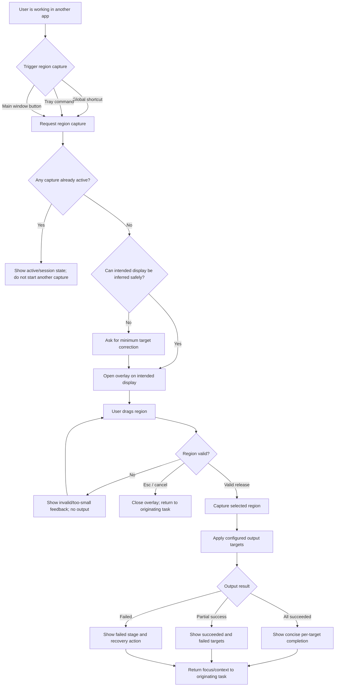
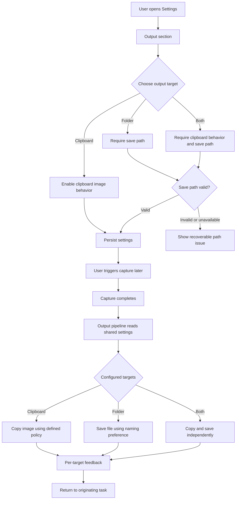
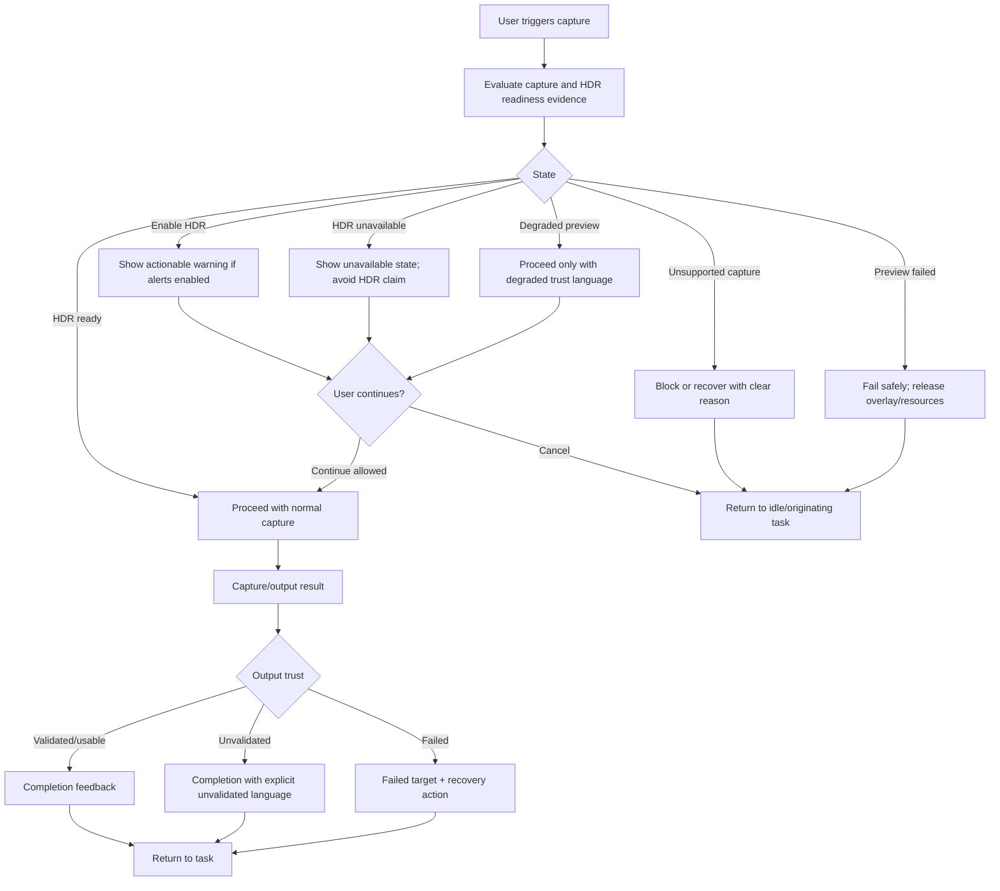

---
stepsCompleted:
  - 1
  - 2
  - 3
  - 4
  - 5
  - 6
  - 7
  - 8
  - 9
  - 10
  - 11
  - 12
  - 13
  - 14
lastStep: 14
inputDocuments:
  - _bmad-output/planning-artifacts/prd.md
  - _bmad-output/planning-artifacts/research/technical-lumiere-mvp-v0-design-winui-wgc-hdr-research-2026-05-09.md
  - _bmad-output/planning-artifacts/ux-design.md
  - _bmad-output/project-context.md
---

# UX Design Specification lumiere

**Author:** lumiere
**Date:** 2026-05-09

---

<!-- UX design content will be appended sequentially through collaborative workflow steps -->

## Executive Summary

### Project Vision

Lumiere is a native Windows HDR screenshot utility designed to make high-fidelity HDR capture feel as fast and unobtrusive as a normal screenshot. The MVP focuses on a compact capture loop: trigger from the main window, global shortcut, or tray; capture fullscreen or select a region directly over the current display; output to the configured destination; then return the user to their original workflow.

The product's UX promise is trust. Lumiere should preserve HDR-first capture and preview semantics where the platform supports them, and it should avoid claiming HDR fidelity when the capture, preview, clipboard, file, or display path is degraded, unsupported, or unvalidated.

For public release, trust copy must be stricter than MVP/private-preview copy. The UI must distinguish four fidelity concepts:

1. Captured through the HDR-first FP16/scRGB path.
2. Previewed on a validated target display.
3. Converted for basic SDR-compatible output.
4. Exported through a validated HDR-preserving output profile.

Completion feedback must describe the artifact result first, then only mention HDR preservation when the active path has target-aware evidence and validation records.

### Target Users

The primary users are Windows users who work with HDR content and need screenshots they can trust: creators reviewing HDR video or visual references, QA and engineering users documenting rendering issues, and technically aware users comparing HDR game, media, or display output.

These users are likely comfortable with desktop utilities, shortcuts, tray controls, and settings, but they should not need to understand WGC, DXGI, color spaces, or output-container limitations during the capture moment.

### Key Design Challenges

The UX must keep the capture flow low-interruption while still communicating fidelity and readiness accurately. Status language needs to distinguish HDR ready, enable HDR, HDR unavailable, degraded preview, unsupported capture, preview failed, output complete, output failed, partial output success, unvalidated output, converted output, and HDR-preserving output without relying on color alone.

The settings and output surfaces must avoid unsupported promises. Clipboard image output can be useful, but it must not imply HDR preservation unless the implementation has defined format, conversion, metadata, target-app, and Windows manual validation evidence.

The native Windows surfaces must feel like one product. Main window commands, tray commands, global shortcuts, overlay states, settings, and output feedback all need to reflect the same capture/session state and persisted settings.

### Design Opportunities

Lumiere can win by being a quiet, trustworthy Windows instrument rather than a broad screenshot suite. A compact main window, direct region overlay, tray-first operation, and release-to-capture behavior can make HDR capture feel immediate without adding galleries, annotation tools, onboarding, or export wizards to the MVP.

The strongest UX opportunity is evidence-based trust feedback: concise native-feeling copy, text plus icon discrimination, clear disabled or degraded states, and completion feedback that tells users exactly which configured outputs succeeded.

## Core User Experience

### Defining Experience

The defining experience for Lumiere MVP is region capture from the user's current workflow: trigger capture, enter an overlay on the current display, drag a valid region, release to capture and output, then return immediately to the original task.

This interaction is the product's center of gravity because it combines Lumiere's three core promises in one moment: low interruption, HDR-aware trust, and configured output without capture-time ceremony.

The experience is only successful if the user can complete capture without changing mental context: no target picker in the default happy path, no output decision during capture, no editor detour, and no ambiguous fidelity claim. The defining experience is complete only when the capture returns focus to the originating task, emits configured output, and presents a concise status for each configured output target.

If capture or output cannot complete, Lumiere should preserve the user's context, report the failed stage clearly, and offer the shortest recoverable next action without trapping the user in the overlay.

### Platform Strategy

Lumiere is a native Windows desktop utility. The primary interaction model is mouse and keyboard, supported by global shortcuts, tray commands, a compact WinUI main window, and a fullscreen overlay for region selection.

The MVP should run locally and offline. It should leverage Windows-specific capabilities where they matter: direct monitor capture, Windows Graphics Capture, D3D11/DXGI scRGB preview, system tray integration, global hotkeys, clipboard, file output, and display/HDR readiness signals.

The UX specification should treat the existing web-style v0 reference as layout and state guidance only. Production interactions must translate into native WinUI and Fluent patterns without importing web stack assumptions.

Main window commands, tray commands, global shortcuts, overlay, settings, diagnostics, and output pipeline should read from one shared session/settings model so the user never sees contradictory capture, output, or trust state across surfaces.

### Effortless Interactions

The region capture path should avoid a target picker in the default happy path. When platform evidence confidently identifies the initiating or current display, Lumiere should move directly into that display's overlay. If Lumiere cannot infer the intended display or capture target with confidence, it should ask for the minimum necessary correction before entering capture, rather than guessing or showing the overlay on the wrong display.

The overlay should feel like a temporary lens over the user's current display, not a mode switch into a separate app. It should preserve orientation, show just enough boundary and readiness feedback to guide selection, and avoid visual noise that competes with the underlying HDR content.

Dragging a valid region and releasing the pointer should complete the capture action. Users should not need to click a second confirmation button in the happy path, choose an output target during capture, or manage a gallery/editor before returning to their task.

Escape should cancel capture and return the user to the original task without side effects. Invalid or too-small regions should be clearly indicated before release when possible, should not produce output, and should never produce misleading success feedback.

Configured output should happen automatically. Clipboard, folder, or both should follow persisted settings shared by the main window, tray, hotkeys, overlay, and output pipeline. The first-run default output target remains an explicit UX/product decision to confirm before implementation.

Trust feedback should be brief and immediately readable. HDR and output states should use concise text plus icon/glyph cues, not color alone, and should avoid success language for degraded, unsupported, failed, or unvalidated states.

### Critical Success Moments

The first success moment is speed: the user presses the shortcut, draws the frame they already had in mind, releases, sees concise output feedback, and is back where they started.

The second success moment is trust: the user understands the capture path state and each output target state as ready, degraded, unsupported, failed, or unvalidated. Clipboard success must not imply HDR preservation unless that path has been validated.

The third success moment is reliability: output goes where the user configured it to go, and failures identify the affected target with a recoverable next action rather than silently dropping the capture.

The fourth success moment is recovery: when capture or output cannot complete as configured, the user knows exactly what failed, what was preserved if anything, and what single next action restores flow.

The make-or-break flow is the default region capture loop. If overlay placement is wrong, drag feedback is unstable, release-to-output is delayed or ambiguous, HDR/output copy overclaims fidelity, or failure traps the user in capture mode, the product's core value is compromised.

### Experience Principles

1. Keep capture faster than explanation: the capture moment should present only the information needed to act or trust the result.
2. Make trust visible but lightweight: HDR and output fidelity states should be explicit, concise, and distinguishable without color alone.
3. Let settings do the remembering: output, shortcuts, alerts, and after-capture behavior should be configured outside the capture moment and obeyed consistently.
4. Treat native Windows integration as part of the UX: tray, shortcuts, overlay, clipboard, file output, and HDR readiness must feel like one coherent utility, not separate features.
5. Do not trade fidelity for convenience silently: if HDR preservation cannot be proven, the UI should say so plainly and recover gracefully.
6. Prefer minimal correction over wrong automation: when target display, capture state, or output path cannot be inferred safely, the UX should ask for the smallest possible user correction.

### Open UX Decision

The MVP must define the first-run default output target before implementation. Until the user chooses settings, Lumiere needs one clear default behavior for region capture, such as clipboard-only, folder-only with prompted folder setup, or a first-run settings prompt. This decision affects the promise that configured output happens without capture-time interruption.

## Desired Emotional Response

### Primary Emotional Goals

Lumiere should make users feel calm confidence: the app is quiet, precise, and trustworthy without demanding attention. The ideal feeling is not excitement for its own sake, but the confidence that the capture will happen quickly, the result will go where expected, and the app will be honest about HDR and output fidelity.

During capture, users should feel focused and in control. The overlay should support the selection they already intend to make, not pull them into a separate editing or export workflow.

After completion, users should feel relieved and productive. The output should be handled according to settings, the result state should be clear, and the user should be able to return to the original task without wondering what happened.

When something goes wrong, users should feel informed rather than blamed. Lumiere should explain the failed stage, preserve context where possible, and offer the shortest recoverable next action without exposing unnecessary technical detail.

### Emotional Journey Mapping

On first discovery, Lumiere should feel like a focused native Windows utility for a problem users already recognize: ordinary screenshot paths are not trustworthy for HDR content.

At trigger time, the desired emotion is readiness. The user should feel that the shortcut, tray command, or main window action moves directly into capture without ceremony.

During region selection, the desired emotion is concentration. The overlay should feel like a temporary lens over the current display, with enough boundary and status feedback to guide the crop while keeping the underlying HDR content primary.

After release, the desired emotion is closure. The user should receive concise feedback about clipboard, file, or partial output status, then return to the originating task.

On failure or degraded paths, the desired emotion is trust under constraint. Users may not get a validated HDR result, but they should understand why the result is degraded, unsupported, failed, or unvalidated, and what action restores flow.

On repeated use, Lumiere should feel dependable and almost invisible: settings are remembered, entry points behave consistently, and the app does not make users re-decide the same things during capture.

### Micro-Emotions

Confidence is more important than surprise. The design should reduce doubt about whether capture started, whether the selected region is valid, whether output completed, and whether HDR claims are trustworthy.

Trust is more important than optimism. The UI should avoid cheerful success language when the capture path, preview, clipboard, file output, or HDR state is degraded or unvalidated.

Satisfaction should come from momentum. The best emotional payoff is the feeling that the screenshot was taken correctly without becoming a new task.

Recovery should feel safe. Canceling, invalid selections, unsupported capture, failed output, and degraded HDR states should leave the user oriented and able to continue.

### Design Implications

To create calm confidence, use concise native-feeling language, stable layout, text plus icon state cues, and restrained visual emphasis. Avoid promotional HDR copy during operational states.

To support focus and control, keep overlay chrome minimal, preserve the user's screen orientation, provide clear crop boundaries, and make Escape/cancel behavior reliable.

To create productive relief, make output feedback specific enough to answer "what happened?" without turning completion into a dialog-heavy workflow.

To preserve trust during errors, name the failed stage in user terms, distinguish failed from degraded or unvalidated states, and offer one clear recovery action when possible.

To avoid anxiety, do not guess the target display when confidence is low, do not show contradictory states across main window/tray/overlay, and do not imply HDR preservation for clipboard output without validation.

### Emotional Design Principles

1. Be quiet unless trust or recovery requires speaking.
2. Favor confidence over delight: the product should feel dependable before it feels clever.
3. Keep the user's original task emotionally primary; Lumiere is a capture instrument, not the destination.
4. Make successful capture feel complete, not merely started.
5. Make failure feel recoverable, specific, and non-punitive.
6. Never use optimistic language to cover unvalidated fidelity.

## UX Pattern Analysis & Inspiration

### Inspiring Products Analysis

**Windows Snipping Tool** is the closest system-level reference for low-friction screen capture. Its strongest UX lesson is that capture should feel immediately available: users understand the entry point, the screen becomes the selection surface, and the tool does not require product education before the first capture. Lumiere should adopt this sense of directness, while avoiding Snipping Tool's HDR ambiguity and avoiding any assumption that a generic bitmap screenshot is good enough for HDR content.

**ShareX** is the best reference for configured output automation. Its strongest UX lesson is that capture can become a repeatable workflow when destinations, naming, clipboard behavior, and after-capture actions are configured once and then obeyed consistently. Lumiere should adapt this principle in a much more restrained MVP form: output settings should be reliable and shared across entry points, but the capture moment should not expose ShareX-like workflow complexity.

**Microsoft PowerToys** is the strongest reference for native Windows utility behavior. It presents powerful capabilities as focused tools, keeps settings discoverable, and uses a practical tone that feels like part of the Windows environment. Lumiere should borrow this utility posture: compact surfaces, clear settings, predictable tray/background behavior, and native-feeling copy.

**CleanShot X / Shottr-style lightweight capture tools** provide secondary inspiration for fast feedback and minimal interruption. Their transferable lesson is the emotional pacing: capture, short confirmation, and return to task. Lumiere can borrow this pacing without borrowing platform-specific macOS behaviors or annotation-heavy workflows.

### Transferable UX Patterns

**System-level capture entry:** A shortcut or tray/main-window command should move users directly into capture with minimal ceremony. This supports Lumiere's core region-capture loop and calm-confidence emotional goal.

**Screen-as-canvas selection:** The user's current display should become the selection surface. Overlay chrome should be minimal and should not visually compete with the HDR content being captured.

**Configured output automation:** Output target, naming, clipboard behavior, and after-capture behavior should be configured outside the capture moment and then obeyed consistently. This pattern supports the promise that users do not re-decide output during capture.

**Utility-style settings:** Settings should be organized around user jobs: shortcuts, output, HDR alerts/status, background/tray behavior, and about/version. Avoid exposing implementation concepts such as WGC, DXGI, scRGB, or encoder internals unless needed for diagnostics.

**Brief completion feedback:** Completion should answer "what happened?" with target-specific status: copied, saved, copied and saved, partial success, or failed. Public-release feedback must not imply HDR preservation unless the active output profile is validated. Feedback should be visible enough to build trust but short enough not to become a workflow step.

**Evidence-based trust status:** Unlike generic screenshot tools, Lumiere should surface HDR readiness and output fidelity states as first-class UX signals. This is a differentiating pattern rather than a borrowed one.

### Anti-Patterns to Avoid

**Picker-first capture as the default path:** A target picker before every region capture would break Lumiere's low-interruption promise. Use it only as a minimal fallback when the intended target cannot be inferred safely.

**Editor or gallery detour after capture:** Opening an editor, history view, or gallery by default would make Lumiere feel like the task destination rather than a capture instrument.

**Power-user automation overload:** ShareX-style depth is useful inspiration, but exposing too many output actions, profiles, naming rules, or post-capture workflows in MVP would dilute the quiet utility experience.

**Color-only status communication:** HDR ready, degraded, failed, unsupported, and completed states must not rely only on green/yellow/red. Text and icon/glyph cues are required.

**Optimistic fidelity copy:** The UI must not use terms such as HDR-preserving, HDR10, P3, perfect fidelity, or validated output unless target-aware detection, implementation semantics, and Windows manual validation evidence exist for that path.

**Wrong-display automation:** Automatically showing the overlay on the wrong display is worse than asking for a minimal correction. Trust requires conservative target inference.

### Design Inspiration Strategy

**Adopt:** the directness of Windows Snipping Tool, the output-obedience principle of ShareX, and the native utility posture of PowerToys.

**Adapt:** lightweight capture feedback from CleanShot X / Shottr-style tools, translated into native Windows and Fluent patterns rather than macOS-style chrome or web-style visuals.

**Reject:** broad screenshot-suite behavior for MVP: annotation-heavy editing, galleries, complex automation builders, default picker-first flows, and unsupported HDR export promises.

**Differentiate:** make HDR trust the unique UX layer. Lumiere should feel familiar as a screenshot utility, but different at the exact moments where ordinary tools become untrustworthy: HDR readiness, degraded preview, output fidelity, and validation language.

## Design System Foundation

### 1.1 Design System Choice

Lumiere should use WinUI 3 and Microsoft Fluent Design as the design system foundation for MVP. This choice aligns the product with native Windows interaction expectations, accessibility conventions, windowing behavior, settings patterns, keyboard/mouse workflows, tray-adjacent utility behavior, and the existing technical stack.

Lumiere should not adopt a web-oriented or cross-platform design system such as Material Design, Ant Design, Tailwind UI, shadcn, or custom web component patterns for production UI. The v0 reference may inform layout intent, hierarchy, and state inventory, but production design should translate those ideas into native WinUI and Fluent patterns.

The product should use a light custom layer on top of WinUI/Fluent for Lumiere-specific needs: HDR readiness semantics, output trust states, overlay selection behavior, concise status language, and restrained brand expression.

### Rationale for Selection

Native Windows fit is more important than visual novelty. Lumiere should feel like a trustworthy Windows utility that belongs beside system tools, PowerToys-style utilities, tray commands, and keyboard shortcuts.

WinUI/Fluent supports the emotional direction of calm confidence: familiar controls, predictable settings surfaces, native typography and spacing, keyboard accessibility, and established state patterns reduce the need for users to learn a new UI language.

The project's technical constraints also favor this foundation. Lumiere is Windows-only, built with WinUI 3 and Windows App SDK, and must avoid introducing web UI stacks or cross-platform shells. Choosing WinUI/Fluent keeps UX design aligned with implementation boundaries.

A fully custom visual system would add unnecessary design and engineering cost for MVP. Lumiere's differentiation should come from the HDR-first capture loop and evidence-based trust feedback, not from reinventing standard desktop controls.

### Implementation Approach

Use native WinUI controls and Fluent patterns for the main window, settings surfaces, dialogs or lightweight prompts, status rows, command buttons, toggles, text fields, path selection controls, and about/version presentation.

Use Lumiere-specific components only where the standard system does not cover the product need: capture overlay chrome, crop boundary visuals, HDR readiness/status badges, output-target status feedback, tray menu wording, and trust/degraded/error state inventory.

Keep the main window compact and utility-like. The app should prioritize capture actions, HDR status, shortcut visibility, output summary, and settings access without becoming a dashboard.

Settings should be organized by user jobs rather than implementation layers: shortcuts, output destination, HDR alerts/status behavior, background/tray behavior, and about/version.

Overlay design should be intentionally minimal. It should use clear crop boundaries, text/icon status cues where needed, reliable cancel affordances, and no visual treatment that competes with the HDR content being captured.

### Customization Strategy

Define Lumiere-specific design tokens only where they support recurring product semantics: status severity, trust state, capture state, overlay boundary emphasis, spacing density, and concise feedback surfaces.

Define a status vocabulary that maps directly to product states: HDR ready, enable HDR, HDR unavailable, degraded preview, unsupported capture, preview failed, output complete, output failed, partial output success, and unvalidated output.

Every state must have a text label and icon/glyph cue. Color may reinforce meaning, but it must not be the only discriminator.

Use restrained branding: Lumiere identity should appear in the main window, about section, tray label, and installer/release surfaces, but should not dominate the capture overlay or operational feedback.

Treat visual polish as subordinate to trust, speed, and recoverability. MVP customization should make the product clearer and more dependable, not merely more decorative.

## 2. Core User Experience

### 2.1 Defining Experience

The defining experience is: trigger like a normal screenshot, frame the target like looking through a lens, release to receive trustworthy output.

For users, Lumiere should feel familiar at the point of action: a shortcut, tray command, or main-window command starts capture; the current screen becomes the selection surface; the user drags the region they already have in mind; release completes the capture. The difference is what happens around that familiar interaction: Lumiere preserves the HDR-first path where supported, obeys configured output settings, and communicates whether the capture and output can be trusted.

This is the interaction that must be nailed before broader polish. If region capture is immediate, stable, honest, and recoverable, the rest of the MVP can build around it.

### 2.2 User Mental Model

Users bring the mental model of ordinary screenshot tools: press a shortcut, select an area, get an image. They expect capture to be fast, local, and reversible. They do not expect to choose a target, tune export settings, or read diagnostics in the capture moment.

HDR-aware users also bring skepticism. They know normal screenshots may make HDR content look washed out, flattened, or misleading. They may not understand every technical cause, but they understand that ordinary output cannot always be trusted.

Lumiere should meet the familiar screenshot expectation while correcting the trust gap. The user should not need to think in terms of WGC, FP16, scRGB, swap chains, encoders, or metadata; the UI should translate those realities into clear states and restrained copy.

Likely confusion points include wrong-display overlay placement, ambiguous output success, unclear clipboard fidelity, hidden save-path failure, disabled capture buttons without reasons, and status language that sounds successful when the path is degraded or unvalidated.

### 2.3 Success Criteria

The core experience succeeds when the user can start region capture from shortcut, tray, or main window without a picker-first interruption in the default path.

The overlay appears on the intended display or asks for the minimum necessary correction when the intended target cannot be inferred safely.

The user can drag a valid region with stable visual feedback, understand invalid or too-small selections, cancel with Escape, and release to complete capture without a second confirmation step in the happy path.

Configured output is applied automatically, and completion feedback identifies the status of each configured target: copied, saved, copied and saved, partial success, failed, degraded, or unvalidated as applicable.

The user returns to the originating task after completion, cancellation, or recoverable failure without stranded overlays, ambiguous status, or conflicting main-window/tray state.

The UI never implies HDR preservation or validated fidelity for clipboard or file output unless the implementation and Windows manual validation support that claim.

### 2.4 Novel UX Patterns

The base interaction uses established screenshot patterns: keyboard shortcut, tray or main-window command, screen overlay, drag-to-select, release-to-capture, and brief completion feedback. This familiarity is intentional and should minimize user education.

The novel part is the trust layer. Lumiere combines familiar capture mechanics with evidence-based HDR and output states. This does not require a new gesture, but it does require disciplined language, text-plus-icon status cues, and state consistency across surfaces.

The product should innovate inside the familiar pattern rather than inventing a new one. The user should remember Lumiere as "the screenshot tool I trust for HDR," not as "the screenshot tool with a strange capture workflow."

### 2.5 Experience Mechanics

**Initiation:** Users can start region capture from a global shortcut, tray command, or main-window action. If another capture is active, the command should reflect the shared session state rather than starting a conflicting flow. If the intended display cannot be inferred safely, the UI should request the smallest correction needed before showing the overlay.

**Interaction:** The fullscreen overlay appears over the selected or inferred display. The user drags to define a crop rectangle. The overlay provides clear boundaries, non-color-only status cues where needed, invalid-region feedback, and a reliable Escape/cancel path.

**Feedback:** During selection, feedback should confirm that the app is in capture mode, show crop boundaries, and indicate invalid geometry before output. After release, feedback should identify output progress or completion without becoming a blocking workflow. HDR/trust states should remain concise and avoid optimistic language when degraded, unsupported, failed, or unvalidated.

**Completion:** A valid release triggers capture and configured output. The user receives concise per-target feedback, then returns to the originating task. Cancellation returns without output. Invalid regions do not produce output. Failures identify the failed stage and provide the shortest recoverable next action.

## Visual Design Foundation

### Color System

Lumiere should use the v0 MVP reference as the visual direction source: dark-first, low-chroma neutral surfaces, restrained indigo accent, and semantic status colors for HDR and output trust states. Production implementation should translate these choices into WinUI/Fluent resources rather than copying Tailwind, OKLCH tokens, or web-specific classes.

The primary surface should feel like a compact native utility: dark background, slightly elevated card surfaces, subtle borders, and controlled contrast. The v0 reference uses a near-black blue-gray background, darker card panels, muted foreground text, and a modest border system; the WinUI version should preserve that quiet depth without over-styling standard controls.

Use a restrained indigo/blue-violet accent for primary actions, focus rings, active segmented selections, Lumiere identity marks, and selected state emphasis. Accent color should support recognition and focus, not become the only signifier of state.

Status color should remain semantic and redundant with text/icon cues:

- Ready / complete: green semantic cue plus text and icon.
- Warning / enable HDR / degraded / unvalidated: amber semantic cue plus text and icon.
- Error / unavailable / failed / unsupported: red semantic cue plus text and icon.
- Neutral / pending / inactive: muted foreground and border treatment.

Do not use color alone to distinguish HDR ready, degraded preview, unsupported capture, preview failed, output complete, output failed, or partial output success.

### Typography System

Use the native Windows/WinUI typography stack, with Segoe UI Variable or the current WinUI default as the production typeface. The v0 reference uses compact, high-density text hierarchy; the WinUI version should preserve the hierarchy while using native text styles and accessible minimum sizes.

Typography should feel practical and precise rather than promotional. Headings should be short and functional. Body copy should be concise. Status and setting descriptions should explain user impact rather than implementation detail.

Recommended hierarchy:

- App/title labels: compact semibold treatment for Lumiere, Settings, and section titles.
- Primary actions: medium/semibold labels with visible shortcut metadata.
- Settings labels: concise body text with optional muted helper text.
- Status labels: small but readable text paired with icon/glyph cues.
- Shortcut and path values: monospace treatment only where it improves scanning.

Avoid long diagnostic paragraphs in primary UI. Detailed diagnostics, if present later, should live behind explicit secondary surfaces.

### Spacing & Layout Foundation

Preserve the v0 reference's compact utility density: main panel around a narrow desktop-utility footprint, clear header/body/footer structure, large capture actions in the center, and persistent status feedback near the bottom.

Use a 4px base spacing rhythm with 8px and 16px as common increments, translated into WinUI spacing resources. Rounded corners should be modest and native-feeling: enough to soften cards and buttons, not enough to make the app feel like a web dashboard.

Main window layout should follow this hierarchy:

1. Header: Lumiere identity and settings access.
2. Primary action area: Fullscreen and Region capture actions, with Region treated as the defining flow.
3. Status/footer area: HDR readiness and minimize/background intent.

Settings layout should use grouped cards or native settings sections organized by user jobs: Shortcuts, HDR alerts/status behavior, Output, Clipboard, Background/tray behavior, and About. Rows should be scannable, with label, helper text when needed, and one control per row.

Tray menu layout should remain compact: identity/status header, capture commands with shortcuts, separator, open main window, settings, and quit. Tray copy and command state should mirror the main window state.

Overlay layout should be the most visually restrained surface. The crop boundary should be clear, invalid states should be legible, and status/cancel affordances should not compete with the underlying HDR content.

### Accessibility Considerations

Every operational state must include text plus icon/glyph cues. Color may reinforce meaning but cannot be the only status channel.

Text contrast should follow accessible Fluent/WinUI expectations for dark theme. Muted helper text must remain readable, especially for status labels, shortcut hints, output feedback, and failure recovery instructions.

Keyboard behavior is part of the visual foundation: focus indicators must be visible on capture buttons, settings controls, shortcut fields, tray-accessible commands where applicable, and cancel paths. Escape must be a reliable visible/behavioral affordance during overlay capture.

Motion should be minimal and purposeful. The v0 reference uses small hover, active, and capturing animations; production WinUI should use subtle feedback only where it confirms action state and should avoid distracting animation during HDR content selection.

The visual foundation must support high-DPI and multi-monitor Windows setups. Overlay boundaries, crop handles or indicators, and status text should remain stable across common scale factors.

## Design Direction Decision

### Design Directions Explored

Six design directions were explored in `_bmad-output/planning-artifacts/ux-design-directions.html`:

1. **Compact Reference Translation:** closest to the v0 MVP reference, with a compact dark utility panel, large capture actions, footer HDR status, and restrained settings access.
2. **Status-Led Trust Panel:** elevates HDR/output trust before actions, useful if readiness needs to dominate the main surface.
3. **Command-First Utility:** emphasizes keyboard and command-style operation, but risks making MVP feel more complex than necessary.
4. **Tray-First Background Tool:** treats tray as the primary surface, useful for background operation but too narrow as the main design direction.
5. **Overlay-Centered Lens:** focuses on the capture overlay as a temporary lens over the current display, with minimal chrome and clear crop boundaries.
6. **Light Fluent Utility:** explores a light theme variant, useful as a future accessibility/theme consideration but not the dark-first MVP direction.

### Chosen Direction

The chosen direction is **Direction 1 + Direction 5**:

- Use **Compact Reference Translation** for the main window, settings, and tray surfaces.
- Use **Overlay-Centered Lens** for the defining region capture experience.

This combination preserves the v0 MVP reference's strongest visual qualities: dark-first utility posture, compact card-like surfaces, restrained indigo accent, large capture actions, bottom HDR status, grouped settings, and compact tray menu. It also gives the overlay its own design priority as the core experience surface.

### Design Rationale

Direction 1 best supports Lumiere's calm-confidence emotional goal. It is familiar, compact, native-utility-like, and avoids turning the product into a dashboard. It keeps the main window focused on the essentials: identity, capture actions, HDR status, shortcut visibility, settings access, and minimize/background intent.

Direction 5 is necessary because the overlay is where the product's promise is proven. The overlay should not feel like a web panel placed over the screen; it should feel like a temporary lens that helps the user frame HDR content without distracting from it. Crop boundaries, invalid-region feedback, cancel affordance, and concise trust status matter more here than brand expression.

Direction 2 was not selected as the primary direction because it risks making trust status feel heavier than the capture action. Its lessons should still be used in status components, but the main panel should stay action-first and compact.

Direction 3 and Direction 4 are useful references for power users and background workflows, but neither should define the MVP's primary visual direction. Direction 6 remains a future light-theme consideration.

### Implementation Approach

Translate Direction 1 into native WinUI/Fluent surfaces:

- A compact main window with header, capture action area, and status footer.
- Large primary capture buttons with icon, label, shortcut metadata, disabled/active states, and non-color-only feedback.
- Grouped settings sections for shortcuts, HDR alerts/status behavior, output, clipboard, background/tray behavior, and about/version.
- Compact tray menu with identity/status header, capture commands, shortcuts, open main window, settings, and quit.

Translate Direction 5 into native overlay behavior:

- Minimal full-screen overlay chrome.
- Clear crop boundary and stable geometry feedback.
- Concise capture/status/cancel cues that do not compete with HDR content.
- Invalid-region and failure states that are visible but not alarming beyond their severity.
- Escape/cancel behavior that reliably returns the user to the originating task.

Use Direction 2's trust emphasis selectively in status components: HDR readiness, degraded preview, unsupported capture, output failed, partial output success, and unvalidated output should remain readable and explicit across main window, tray, overlay, and completion feedback.

## User Journey Flows

### Default Region Capture Flow

This is the defining MVP journey: users trigger region capture from their current workflow, select a valid region on the intended display, release to capture, receive configured output feedback, and return to the original task.

Key design requirements:

- Default path avoids picker-first capture.
- Wrong-display automation is worse than a minimal correction step.
- Valid release completes capture without a second confirmation.
- Invalid regions and cancellation never produce output.
- Completion feedback must identify each configured output target.

### Output Configuration and Automatic Execution Flow

This journey covers users configuring where captures go, then expecting every entry point to obey those settings without capture-time interruption.

Key design requirements:

- Settings are the source of truth for main window, tray, hotkeys, overlay, and output.
- Capture should not ask users to choose output unless first-run/default behavior remains unresolved.
- Clipboard success means clipboard usability, not HDR preservation, unless that path has validation evidence.
- Folder failures must identify path/permission/write issues in user terms.

### HDR Trust and Failure Recovery Flow

This journey covers degraded or failed states while preserving user trust and recoverability.

Key design requirements:

- HDR status must distinguish ready, enable HDR, unavailable, degraded preview, unsupported capture, preview failed, output complete, output failed, partial success, and unvalidated output.
- Status must use text plus icon/glyph cues, not color alone.
- Error language should name the user-visible failed stage, not low-level implementation jargon.
- Recovery should be one clear next action when possible.

### Journey Patterns

**Entry pattern:** shortcut, tray, and main-window actions all request the same capture/session controller instead of creating parallel flows.

**Target confidence pattern:** infer display when confidence is high; ask for minimal correction when confidence is low; never guess into a wrong overlay.

**Feedback pattern:** every important transition should answer one question: capture started, region valid, output in progress, output complete, output partial, output failed, or trust degraded.

**Recovery pattern:** cancellation, invalid region, unsupported capture, preview failure, clipboard failure, and file failure must end in a recoverable idle/originating-task state.

**Trust pattern:** success copy must be scoped to what actually succeeded. Completion and HDR preservation are separate claims.

### Flow Optimization Principles

1. Minimize decisions during capture; move configuration decisions to settings.
2. Make the happy path fast, but make failure paths short and safe.
3. Keep user context primary; Lumiere should not become the destination after capture.
4. Treat output targets independently so partial success is understandable.
5. Prefer explicit unvalidated/degraded language over optimistic ambiguity.
6. Keep all entry points visually and behaviorally consistent through shared session/settings state.

## Component Strategy

### Design System Components

Lumiere should use native WinUI/Fluent components wherever they match standard Windows expectations. Foundation components include window chrome, buttons, icon buttons, toggles, text inputs, path/folder selection controls, segmented or radio-style options, settings rows, grouped settings cards/sections, text labels, tooltips, lightweight dialogs or teaching tips, focus visuals, and standard accessibility behavior.

These foundation components should cover most of the main window and settings experience:

- Main window header, settings button, and minimize/background affordance.
- Fullscreen and region capture action buttons built from native button patterns.
- Settings rows for shortcuts, output target, save path, HDR alerts, clipboard image behavior, and about/version information.
- Dialog or prompt patterns for minimal correction when target display or output path needs user input.
- Standard keyboard focus, high-contrast compatibility, and text scaling behavior.

Native controls should be styled through WinUI/Fluent resources and Lumiere-specific semantic tokens, not through a copied web component system.

### Custom Components

#### Capture Action Button

**Purpose:** Starts fullscreen or region capture from the main window while showing mode, icon, shortcut, and active/disabled state.

**Usage:** Use for primary capture actions in the compact main panel. Region capture should be visually emphasized as the defining flow without hiding fullscreen capture.

**Anatomy:** Icon or glyph, action label, shortcut metadata, optional state text, focus ring, disabled reason where needed.

**States:** Default, hover, pressed, focus-visible, active capturing, disabled because another capture is active, disabled/unavailable with short reason.

**Accessibility:** Button name must include the capture mode. Shortcut text must not be the only accessible label. Disabled states should expose a reason in nearby text or accessible description.

**Content Guidelines:** Use short labels: Full Screen, Region, Capturing..., Capture unavailable, Shortcut Shift+A. Avoid implementation labels such as WGC or HMONITOR.

#### Trust Status Badge

**Purpose:** Communicates HDR readiness, preview trust, and output fidelity state across main window, tray, overlay, and completion feedback.

**Usage:** Use whenever users need to know whether capture or output can be trusted.

**Anatomy:** Icon/glyph, text label, optional detail text, semantic color cue, optional dot indicator.

**States:** HDR ready, enable HDR, HDR unavailable, degraded preview, unsupported capture, preview failed, output complete, output failed, partial output success, unvalidated output, converted output, HDR-preserving output.

**Accessibility:** Every state requires text plus icon/glyph. Color cannot be the only discriminator. Status changes after capture or output should be announced where platform conventions support it without becoming noisy.

**Content Guidelines:** Be concise and evidence-scoped. Do not use HDR-preserving, HDR10, P3, perfect fidelity, or validated language unless the path is target-aware, implemented, and manually validated.

#### Overlay Lens

**Purpose:** Provides the full-screen region selection surface over the intended display.

**Usage:** Use for region capture after target display is inferred or explicitly selected.

**Anatomy:** Dim or transparent screen treatment, crop boundary, optional handles/geometry affordance, status/cancel strip, invalid-region feedback, minimal trust cue.

**States:** Ready to select, dragging, valid region, invalid/too-small region, degraded/unsupported warning, output in progress, failed, canceled.

**Accessibility:** Escape must cancel. Any visible cancel affordance must have keyboard access where feasible. Text/status cues must remain readable across HDR/SDR displays and DPI scales.

**Content Guidelines:** Keep chrome minimal. The underlying HDR content is the focus; the overlay is a temporary lens, not a separate workspace.

#### Output Result Toast / Feedback Surface

**Purpose:** Confirms what happened after capture and identifies per-target success or failure.

**Usage:** Use after release-to-capture and output execution.

**Anatomy:** Outcome icon, concise title, per-target result line, optional recovery action.

**States:** Copied, saved, copied and saved, partial success, clipboard failed, file failed, unvalidated output, converted output, degraded output, HDR-preserving output.

**Accessibility:** Feedback must be readable and available long enough to perceive. Important failures should not disappear before the user can act.

**Content Guidelines:** Completion, conversion, and HDR preservation are separate claims. Prefer "Copied to clipboard" over "HDR copied" unless the selected output profile has validation evidence.

#### Settings Section / Setting Row Pattern

**Purpose:** Keeps settings scannable and organized around user jobs.

**Usage:** Use for Shortcuts, HDR alerts/status behavior, Output, Clipboard, Background/tray behavior, and About.

**Anatomy:** Section icon/title, grouped container, row label, optional helper text, trailing control, validation or disabled state text.

**States:** Default, edited, invalid, disabled/pending implementation, save-path unavailable, shortcut conflict, registration failed.

**Accessibility:** Row labels must map to controls. Validation messages must be programmatically associated with the affected control where feasible.

**Content Guidelines:** Describe user impact, not implementation detail. Pending or unsupported controls must not look fully functional.

#### Tray Status Menu

**Purpose:** Provides compact background access to status, capture commands, settings, main window, and quit.

**Usage:** Use from the Windows tray integration.

**Anatomy:** Lumiere identity/status header, fullscreen command, region command, shortcut labels, open main window, settings, quit, separators.

**States:** Idle, capture active, capture unavailable, HDR degraded/unavailable, command disabled because another session is active.

**Accessibility:** Keyboard and screen-reader behavior should follow native menu expectations as much as the tray implementation allows.

**Content Guidelines:** Mirror main window command language. Do not introduce separate tray-only state vocabulary.

### Component Implementation Strategy

Use native WinUI/Fluent controls as the base and create Lumiere-specific wrappers only when they encode recurring product semantics: capture mode, trust state, output target result, overlay geometry, or settings validation.

All custom components should consume shared typed state models rather than duplicating ad hoc strings. Component design should assume one shared session/settings source of truth across main window, tray, hotkeys, overlay, and output pipeline.

Component state names should align with product vocabulary from the PRD and UX specification. Avoid creating parallel visual states that do not map to implementation states.

Accessibility and validation should be designed with the component, not added later. Each component needs defined keyboard behavior, non-color-only state cues, disabled/error copy, and high-DPI/multi-monitor considerations where relevant.

### Implementation Roadmap

**Phase 1 - Core Capture Components:** Capture Action Button, Trust Status Badge, Overlay Lens, and Output Result Feedback. These are required for the defining region capture journey.

**Phase 2 - Settings and Consistency Components:** Settings Section/Row pattern, output target selector, shortcut editor/readonly shortcut display, save-path validation surface, and shared status copy pattern. These support configured output and repeatable behavior.

**Phase 3 - Tray and Background Components:** Tray Status Menu, active-session tray command states, background/minimize affordance, and quit/release-state feedback. These support low-interruption background operation.

**Phase 4 - Public Fidelity Components:** Fidelity contract disclosure, target-aware trust detail, supported output profile status, richer validation evidence view, and public-release copy hardening. These do not block the private MVP foundation, but they do block a public perfect-HDR-fidelity release.

## UX Consistency Patterns

### Button Hierarchy

**When to Use:** Use button hierarchy to make capture actions immediately clear while keeping utility actions secondary.

**Primary Action:** Region capture is the defining MVP action and should receive the strongest emphasis where fullscreen capture is also present. Use primary styling for the action most relevant to the current surface, especially Region in the main panel.

**Secondary Action:** Fullscreen capture, browse folder, open settings from secondary contexts, and non-defining capture actions should use secondary styling.

**Utility Action:** Settings, minimize/background, open main window, and back navigation should be visually quiet but discoverable.

**Destructive Action:** Quit should be clearly separated and use destructive semantics, especially in tray menus.

**Behavior:** Disabled buttons must communicate why they are disabled when the reason is not obvious, such as active capture, unsupported capture, missing save path, or unavailable target.

**Accessibility:** Shortcut text must not replace accessible button names. Focus visuals must be visible in dark theme and high-DPI contexts.

### Feedback Patterns

**HDR and Trust Feedback:** Use Trust Status Badge patterns for HDR ready, enable HDR, HDR unavailable, degraded preview, unsupported capture, preview failed, output complete, output failed, partial output success, unvalidated output, converted output, and HDR-preserving output.

**Output Feedback:** Completion feedback should identify per-target results. Use "Copied to clipboard", "Saved to folder", "Copied and saved", "Clipboard failed", "File save failed", or "Partial output" rather than generic success or failure. Use HDR preservation language only when the selected output profile has target-aware validation evidence.

**Invalid Crop Feedback:** Invalid or too-small regions should be indicated during selection when possible. They must not produce output and must not show success feedback.

**Active Capture Feedback:** When capture is active, every entry point should reflect that shared state. Other capture commands should be disabled or redirected to the active state rather than starting a competing session.

**Error Feedback:** Error messages should name the failed user-visible stage and provide one recovery action when possible. Avoid low-level implementation language in primary UI.

**Accessibility:** Feedback must use text plus icon/glyph cues. Color may reinforce state but cannot be the only indicator.

### Form Patterns

**Settings Structure:** Settings should be grouped by user job: Shortcuts, HDR alerts/status behavior, Output, Clipboard, Background/tray behavior, and About.

**Shortcut Fields:** Shortcut controls should show current bindings, support editing only when registration behavior exists, and show conflicts or registration failure in user terms.

**Output Target Selection:** Clipboard, folder, and both should be presented as mutually exclusive target options. Folder or both requires save-path visibility and validation.

**Save Path Validation:** Invalid, missing, inaccessible, or permission-denied paths should show inline recovery guidance near the path control.

**Pending or Unsupported Controls:** Controls whose semantics are not implemented or validated should be hidden, disabled, or explicitly scoped. They must not appear fully functional.

**Accessibility:** Labels, helper text, and validation messages should be associated with their controls where platform support allows.

### Navigation Patterns

**Main to Settings:** Settings should open from the main panel header and tray menu. Return from settings should restore the compact main panel without resetting session/settings state.

**Tray to Main/Settings:** Tray commands should mirror main-window language and state. Tray should not introduce a separate workflow or vocabulary.

**Overlay Exit:** Escape and visible cancel affordances should close overlay and return to the originating task without output. Completion should also return to the originating task after feedback.

**Minimal Correction:** If target display or capture target cannot be inferred safely, show the smallest correction UI needed before entering overlay. Do not use a full picker-first workflow as the default.

### Additional Patterns

**Overlay Pattern:** The overlay is a temporary lens over the current display. Use clear crop boundaries, minimal chrome, concise status/cancel cues, and stable geometry. The overlay must not compete visually with HDR content.

**Loading / Active Pattern:** Use short, specific active states such as Capturing..., Preparing overlay..., Copying..., Saving..., Cleaning up..., or Output in progress. Avoid indefinite generic spinners without stage language.

**Partial Success Pattern:** Treat output targets independently. If clipboard succeeds and file save fails, feedback should preserve the successful result and clearly identify the failed target.

**Recovery Pattern:** Every failed capture/output path should end in a recoverable idle or originating-task state. The user should know whether anything was captured or saved.

**Validation Language Pattern:** UI copy should distinguish implemented, degraded, unsupported, unvalidated, converted, and manually validated behavior. Do not collapse them into generic success language.

## Responsive Design & Accessibility

### Responsive Strategy

Lumiere MVP is a Windows desktop utility, not a web, tablet, or mobile product. Responsive design should therefore mean adaptation across Windows desktop conditions: compact and expanded window sizes, DPI scaling, text scaling, high-contrast modes, multi-monitor layouts, HDR/SDR mixed displays, and tray/background operation.

The main window should remain compact and utility-like. It should have a defined minimum usable size that preserves the header, primary capture actions, and HDR/status footer without clipping essential content. If extra space is available, the layout should not become a dashboard; it may add breathing room or show slightly richer status/output summary, but capture actions remain primary.

Settings may require vertical scrolling at compact sizes. Settings rows should preserve labels, helper text, controls, and validation messages without truncating critical recovery information.

The overlay must adapt to the target display rather than the app window. Crop boundaries, status/cancel cues, invalid-region feedback, and trust messages must remain stable across display scale factors and multi-monitor arrangements.

Tray menu behavior should follow native menu sizing and positioning expectations. It should remain compact and readable without introducing a separate responsive layout model.

### Breakpoint Strategy

Do not use mobile/tablet/web breakpoints for MVP. Use Windows desktop layout constraints instead:

- **Compact main window:** default MVP utility footprint based on the v0 reference.
- **Minimum usable window:** smallest size that still supports capture buttons, shortcut labels or accessible equivalents, settings entry, and status footer.
- **Expanded desktop window:** optional additional spacing or secondary status detail; no dashboard expansion unless future scope changes.
- **Settings scroll boundary:** settings content should scroll vertically before controls collapse into ambiguous or unreadable layouts.
- **Overlay display boundary:** overlay uses target monitor dimensions and DPI scale rather than main-window size.

Any layout adaptation should preserve user orientation and state. Resize must not reset settings, active session state, or output feedback.

### Accessibility Strategy

Target WCAG AA-aligned behavior where applicable, plus Windows accessibility expectations for native desktop apps. Lumiere should be usable with keyboard, visible focus indicators, screen reader semantics, high contrast modes, text scaling, and non-color-only status cues.

Key requirements:

- Every capture command, settings control, tray command, and overlay cancel path must be reachable or represented through expected Windows keyboard behavior where the platform surface allows it.
- Escape must cancel overlay capture when safe and return to the originating task without output.
- Every HDR, output, degraded, unsupported, failed, partial, and unvalidated state must include text plus icon/glyph cues. Color cannot be the only discriminator.
- Focus indicators must be visible against dark surfaces and compatible with high contrast themes.
- Text must remain readable under Windows text scaling and common DPI settings.
- Status updates should be announced or exposed to assistive technologies where appropriate without creating noisy repeated announcements.
- Shortcut editing must not trap keyboard focus and must provide conflict/registration failure feedback in user terms.
- Overlay geometry feedback must be understandable without relying only on hue, especially for invalid or too-small regions.

### Testing Strategy

Accessibility and desktop adaptation should be validated through both automated and manual checks.

**Automated / review checks:**

- Verify that state components include text labels and icon/glyph cues.
- Review accessible names for capture buttons, settings controls, shortcut fields, and output feedback.
- Verify disabled and error states expose user-readable reasons.
- Confirm UI copy does not use unsupported HDR-preserving claims.

**Windows manual checks:**

- Keyboard-only navigation through main window and settings.
- Escape/cancel behavior during overlay capture.
- Focus visibility in dark theme and high contrast mode.
- Text scaling and DPI scaling across common values.
- Multi-monitor overlay placement, including mixed DPI and HDR/SDR displays.
- Screen reader inspection for command names, status state exposure, and output feedback.
- Tray menu readability and command state consistency.
- Clipboard/file output failure feedback persistence and readability.

### Implementation Guidelines

Use native WinUI accessibility properties and control patterns before custom behavior. Custom components should explicitly define accessible names, roles/control types where needed, keyboard interactions, focus behavior, and state descriptions.

Do not create visual-only state. Every visual state must map to text, icon/glyph, and typed product state.

Keep overlay chrome minimal but not inaccessible. The overlay may be visually quiet, but cancel, invalid-region, degraded, and failure states must remain perceivable and operable.

Prefer layout resilience over pixel-perfect reproduction of the v0 reference. Preserve the reference's hierarchy, density, and emotional direction, but allow native WinUI layout behavior to handle text scaling, DPI, and accessibility.

Record Windows manual validation separately for behavior CI cannot prove: HDR displays, WGC timing, overlay placement, DPI scaling, tray/hotkeys, screen reader behavior, and clipboard/file output.
