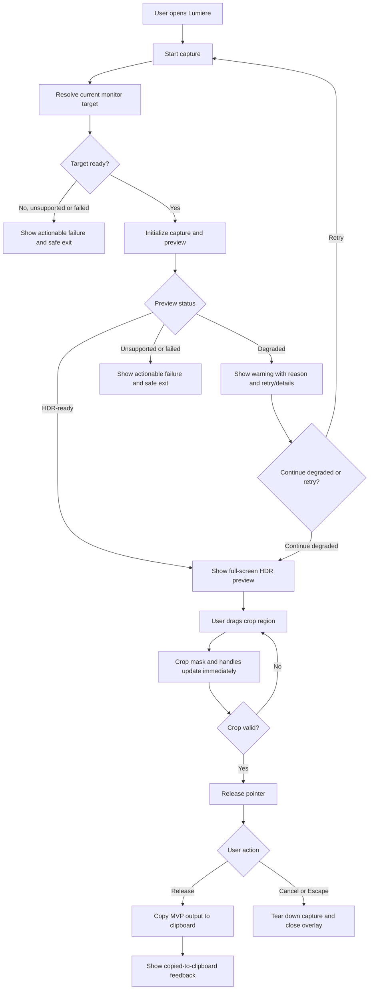
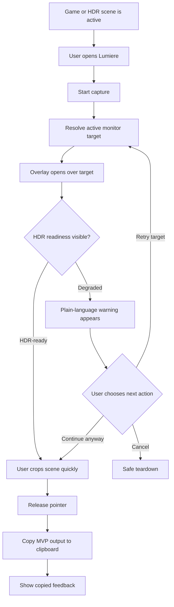
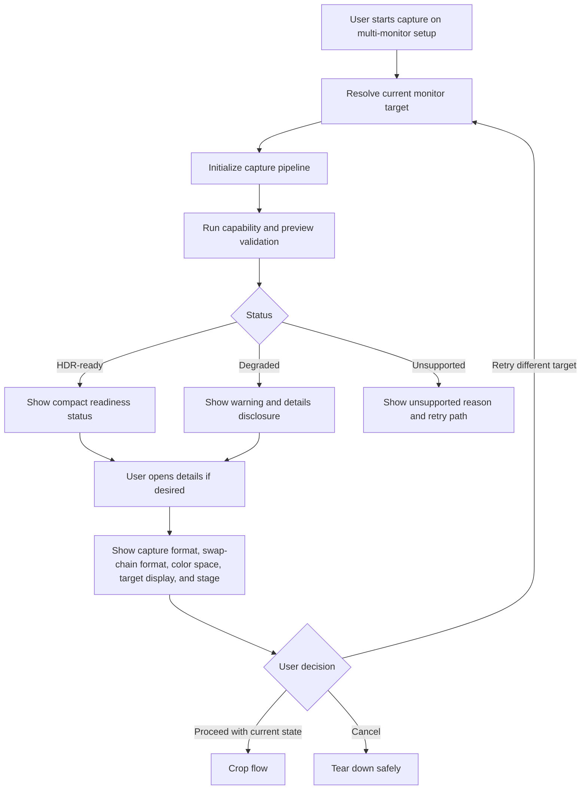
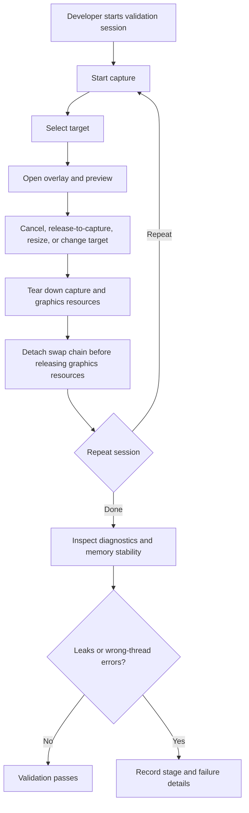

# UX Design Specification — Lumiere

**Author:** Asherliao
**Original:** 2026-04-20
**Revised:** 2026-05-08 (aligned with 6-Epic MVP-to-1.0 rebaseline)

---

## MVP Scope Anchor

This document is aligned with the 2026-05-08 v0 MVP scope expansion. The canonical MVP route is the ten-epic structure in `_bmad-output/planning-artifacts/epics.md`. The visual and interaction reference is the v0 MVP prototype at `harness/design/v0-mvp-reference/`.

**MVP default capture flows:**

**Region capture (existing):**
1. Click Region button (or press shortcut).
2. Enter a full-screen overlay without a picker-first step (direct monitor capture).
3. Drag a region.
4. Release to capture/copy.
5. Show lightweight copied-to-clipboard feedback.
6. Use Escape as the reliable cancel path.

**Full screen capture (new):**
1. Click Full Screen button (or press shortcut).
2. Capture the entire current monitor.
3. Automatically copy to clipboard.
4. Show lightweight copied-to-clipboard feedback.

**MVP now includes:** main panel UI refactoring, full screen capture mode, settings panel (shortcuts, HDR, output, path), and tray context menu. These were previously deferred post-1.0 but are now part of the expanded MVP scope based on the v0 design reference.

**MVP does not include:** multi-action toolbar, annotation tools, advanced diagnostics, or capture history. These remain deferred post-1.0 (see `epics.md` Deferred Post-1.0 Roadmap).

**Completion semantics:** Epic 1-7 done = MVP feature implementation complete. Epic 8 done = MVP output and validation complete. Epic 9 done = MVP validated. Epic 10 done = 1.0 installable release complete.

## Executive Summary

### Project Vision

Lumiere is a native Windows screenshot tool designed around one trust-critical promise: HDR screen captures should preview with the same brightness, contrast, and color relationships users see on their HDR display, instead of being flattened by ordinary SDR screenshot workflows.

From a UX perspective, Lumiere should feel like a precise capture instrument rather than a general-purpose annotation app. The first MVP experience must let users click Capture, enter a full-screen selection overlay without picker-first target selection, inspect an HDR-faithful live preview, drag the region they care about, release to capture/copy, and understand whether the preview/output can be trusted. The product should make HDR correctness visible without requiring users to understand Direct3D, DXGI, scRGB, or Windows.Graphics.Capture.

The MVP should prioritize confidence, clarity, and low-friction capture over broad workflow features. A narrow default clipboard output is now part of the MVP completion moment, but advanced export, configurable clipboard behavior, annotations, hotkeys, tray integration, settings, and history remain post-1.0 capabilities.

### Target Users

Lumiere's primary users are HDR display users who are poorly served by ordinary screenshot tools:

- HDR creators and colorists who need reference captures that do not misrepresent highlight detail, contrast, or color relationships.
- HDR gamers who want quick captures of high-contrast scenes without washed-out results.
- Windows power users with HDR/SDR or multi-monitor setups who need to know whether the selected display and preview path are trustworthy.
- Developers and testers validating that the capture, preview, crop, and teardown pipeline remains stable across repeated sessions.

These users range from non-technical screenshot users to highly technical graphics-aware users. The interface therefore needs progressive disclosure: simple status and actions by default, with advanced diagnostics available when users need deeper evidence.

### Key Design Challenges

The first major challenge is visual trust. The preview is the product's proof of value, so the UI must clearly communicate when the HDR preview is ready, degraded, unsupported, or failed. Silent SDR fallback would damage trust and must be avoided both technically and visually.

The second challenge is interaction over a live GPU-backed preview. The full-screen overlay must place crop controls, masks, handles, lightweight completion feedback, and status messaging above a `SwapChainPanel` without breaking hit testing, layout stability, or crop coordinate mapping.

The third challenge is keeping technical complexity understandable. Lumiere must expose enough information for users to understand ready/degraded/failed states, while keeping the default flow simple enough for users who only want to click Capture, drag a region, release to copy, or press Escape to cancel.

The fourth challenge is safe escape and recovery. Because the product uses a full-screen overlay, users must always have clear cancel paths, keyboard escape behavior, and visible feedback when capture initialization, preview setup, or graphics resources fail.

### Design Opportunities

Lumiere can differentiate through a confidence-first capture experience. A clear HDR readiness indicator, visible degraded-state warnings, and trustworthy preview behavior can become part of the product identity.

The full-screen overlay can make capture feel focused and immediate: the user's content remains the center of the experience, while crop controls and status information stay minimal, stable, and easy to dismiss.

Progressive diagnostics can serve both novice and advanced users. A non-technical status message can explain what the user should do next, while an optional advanced panel can expose capture format, preview format, color space, target monitor, and failure stage.

The crop workflow can become a reliability signal. Responsive selection, clear non-selected masking, predictable handle behavior, and keyboard-safe cancellation will help users believe the HDR pipeline is not only correct but usable under real desktop conditions.

## Core User Experience

### Defining Experience

The defining Lumiere MVP experience is: start capture, enter direct full-screen region selection, see a trustworthy HDR live preview, drag a crop region, release to capture/copy, and return to work with lightweight completion feedback.

The most important user action is drawing and adjusting a crop over a live HDR preview. This action must feel immediate, stable, and visually clear because it is where Lumiere's technical promise becomes usable. If the preview is faithful but the crop interaction feels fragile, the product will still feel untrustworthy.

The MVP core loop is:

1. Start capture.
2. Resolve the current monitor through the direct monitor capture path.
3. Enter a full-screen overlay with live HDR preview.
4. Read the preview trust status at a glance.
5. Drag to create or adjust a crop.
6. Release to capture/copy, or press Escape to cancel safely.
7. Tear down capture and preview resources predictably.

For MVP, the completed result is a usable clipboard output with explicit semantics. If the clipboard result is SDR or tone-mapped, Lumiere must not describe it as HDR-preserving. Advanced export semantics remain post-1.0 until HDR-preserving and SDR tone-mapped output behavior is separately specified.

### Platform Strategy

Lumiere is a Windows-native desktop application. The UX should assume mouse and keyboard as the primary input model, with full-screen desktop overlay behavior rather than a web, mobile, or touch-first interface.

Platform decisions:

- Primary platform: Windows desktop.
- Primary input: mouse and keyboard.
- Primary surface: full-screen WinUI 3 overlay containing a DirectX-backed `SwapChainPanel`.
- Preview model: GPU-rendered HDR preview, not a bitmap or ordinary image control.
- Runtime mode: local and offline for all MVP capture workflows.
- OS integration: Windows.Graphics.Capture consent/capability behavior, direct monitor capture, fallback/debug picker behavior, and monitor capability awareness.
- Escape behavior: keyboard cancel must always be available where practical, especially because the overlay is full-screen.

The UI must respect platform constraints. WinUI/XAML controls should own crop, toolbar, and status interactions, while the HDR preview stays in the DirectX presentation layer. The user should not experience that technical split; the preview and controls should feel like one coherent capture surface.

### Effortless Interactions

The following interactions should require little or no thought:

- Start capture from the app's primary action.
- Enter direct region selection without a picker-first step.
- Understand whether the preview is HDR-ready, degraded, unsupported, or failed.
- Drag to create a crop rectangle.
- See the selected area and non-selected area clearly while dragging.
- Adjust or recreate a crop without restarting the capture.
- Release to capture/copy when the crop is valid.
- Press Escape to cancel without side effects.
- Cancel the overlay with an obvious control and keyboard escape path.
- Recover from unsupported or degraded capture states without guessing what went wrong.

The app should automatically handle validation, status classification, and resource cleanup. Users should not need to choose HDR formats, swap-chain formats, color spaces, or graphics options. Advanced users may inspect these details, but only through progressive disclosure.

Compared with existing screenshot tools, Lumiere can eliminate the user's current workaround loop: capture, inspect washed-out output, retry, change tool, or explain that the screenshot does not match the display. The effortless moment is seeing the preview preserve the HDR scene before any export feature exists.

### Critical Success Moments

The first critical success moment is the initial HDR preview. The user should quickly recognize that the preview does not have the washed-out SDR look that motivated the product.

The second critical success moment is crop creation. The crop rectangle should appear immediately, remain stable over the live preview, and make the selected region unmistakable.

The third critical success moment is degraded-state honesty. If Lumiere cannot prove HDR correctness, it should say so clearly and give the user a next action instead of pretending the capture is valid.

The fourth critical success moment is safe exit. Release-to-capture, cancel, initialization failure, and teardown should never leave the user trapped in a full-screen overlay or uncertain about whether capture is still running.

The make-or-break flows are:

- First successful HDR target selection and preview.
- Dragging and adjusting crop over the preview.
- Handling unsupported or degraded HDR conditions.
- Cancelling safely from any overlay state.
- Repeating capture sessions without visible instability.

### Experience Principles

1. Trust the preview first.
   Every UX decision should reinforce whether the live preview can be believed. HDR readiness, degradation, and unsupported states must be visible and understandable.

2. Keep capture focused.
   The MVP should avoid annotation, export, history, and hotkey complexity until the HDR preview and crop flow are proven.

3. Make technical truth readable.
   Users should get simple, actionable status by default, with advanced diagnostics available for power users and developers.

4. Preserve the user's escape hatch.
   A full-screen overlay must always provide safe cancel, keyboard escape, and recoverable failure behavior.

5. Let content stay central.
   The captured screen content is the main visual experience. Crop UI, status, and controls should support the preview without competing with it.

6. Never hide degradation.
   If Lumiere cannot preserve or prove HDR correctness, the UX must say so directly rather than smoothing over the problem with misleading success states.

## Desired Emotional Response

### Primary Emotional Goals

Lumiere should make users feel confident that what they see in the preview can be trusted. The primary emotional goal is visual confidence: the user should believe that the capture preview represents the HDR scene more faithfully than ordinary screenshot tools.

The second emotional goal is control. Users should feel that they can quickly choose the right target, draw the crop they intended, adjust it without friction, and leave the overlay safely at any time.

The third emotional goal is relief. Lumiere is solving a frustrating failure mode: washed-out HDR screenshots. When the preview looks right, users should feel that a problem they previously had to work around has finally been handled directly.

The product should feel precise, calm, and technically honest. It should not feel decorative, mysterious, or overly clever.

### Emotional Journey Mapping

When users first discover Lumiere, they should feel that it was built for a specific problem they recognize: HDR screenshots that do not match the display.

When users start capture, they should feel focused rather than interrupted. Target selection and overlay startup should communicate that capture is beginning through normal Windows-supported mechanisms.

During the core experience, users should feel oriented and in control. The live preview should remain central, crop feedback should be immediate, and status messaging should answer the one emotional question under the surface: "Can I trust this?"

After completing the MVP crop flow, users should feel assured that the selected region and preview state are valid within the app. Because export is post-MVP, the UX should avoid implying that final output semantics are already solved.

When something goes wrong, users should feel informed rather than blamed. Unsupported, degraded, or failed states should explain what happened, where the issue occurred, and what can be tried next without requiring graphics API knowledge.

When returning to Lumiere, users should feel that the tool is dependable: it opens, previews, crops, cancels, and tears down predictably.

### Micro-Emotions

The most important micro-emotion is trust over skepticism. HDR users may arrive skeptical because other tools have already failed them. The first successful preview must reduce that skepticism quickly.

The second is calm over anxiety. A full-screen overlay can feel risky if users cannot see how to exit. Visible cancel affordances, keyboard escape behavior, and stable overlay states should keep the experience calm.

The third is precision over fuzziness. Crop handles, masks, status indicators, and diagnostics should feel exact enough for creators, power users, and developers.

The fourth is honesty over false reassurance. A degraded preview warning may be disappointing, but it should still build trust because the app is not pretending the result is valid.

The fifth is satisfaction over delight. Lumiere may create a delightful moment when the HDR preview looks right, but the desired lasting feeling is satisfaction: "This finally works."

### Design Implications

Confidence requires visible preview trust status. The overlay should distinguish HDR-ready, degraded, unsupported, and failed states with clear labels, concise explanations, and optional technical details.

Control requires stable crop interaction. Dragging, resizing, replacing, and releasing a crop should not move the preview surface, change coordinate mapping, or surprise the user.

Relief requires reducing repeated workaround behavior. The app should avoid asking users to manually choose color formats, HDR modes, or graphics settings in the default flow.

Calm requires safe exits. Cancel controls, keyboard escape, and failure recovery must remain available even when capture initialization or graphics setup fails.

Precision requires layered information. Basic users need a plain-language status; advanced users need details such as capture pixel format, swap-chain format, color space, monitor capability, and failure stage.

Honesty requires explicit degraded states. The app should never use friendly success language when HDR correctness cannot be established.

### Emotional Design Principles

1. Earn trust before asking for loyalty.
   The preview and status model must prove that Lumiere is handling HDR differently from ordinary screenshot tools.

2. Make control visible.
   Users should always know what they can do next: select, drag, adjust, release to capture, cancel, retry, or inspect diagnostics.

3. Prefer calm precision over spectacle.
   The UI should stay quiet enough that the captured content remains the focus.

4. Treat failure as part of trust.
   Unsupported and degraded states should be clear, recoverable, and honest.

5. Give experts evidence without burdening everyone.
   Advanced diagnostics should be available, but not required for the default capture flow.

## UX Pattern Analysis & Inspiration

### Inspiring Products Analysis

The primary inspiration source is Windows Snipping Tool / Snip & Sketch.

Windows Snipping Tool works well because it treats screenshot capture as a short, focused system-level task. Users can invoke capture, select a region, cancel safely, and return to their previous desktop context without feeling like they have entered a large creative application.

Relevant strengths:

- Capture starts from a clear primary action.
- Region selection is lightweight and direct.
- The full-screen capture mode keeps the user's desktop content central.
- The selection interaction is familiar to Windows users.
- Cancel and escape behavior are easy to understand.
- The tool does not require users to configure advanced settings before taking a basic screenshot.

Snipping Tool also reveals gaps that Lumiere must address differently:

- It does not communicate HDR preview fidelity as a first-class status.
- It is optimized for ordinary screenshots rather than GPU-resident HDR preview trust.
- It does not expose advanced capture/rendering diagnostics for power users.
- Its simplicity should inspire Lumiere's default flow, but not limit Lumiere's need for explicit degraded and unsupported states.

### Transferable UX Patterns

The strongest transferable pattern is the focused capture overlay. Lumiere should similarly place the user's screen content at the center of the experience and make crop selection the dominant interaction.

Another transferable pattern is direct manipulation. Dragging to create a region should feel familiar, immediate, and low-friction. Users should not need to learn a new selection model just because Lumiere's rendering pipeline is more advanced.

The third transferable pattern is safe cancellation. Snipping Tool makes cancellation feel ordinary rather than exceptional. Lumiere should preserve that feeling, especially because a full-screen overlay can otherwise create anxiety.

The fourth transferable pattern is minimal default UI. Lumiere should not force diagnostics, settings, or advanced HDR terminology into the default crop moment. Instead, it should show a concise trust status and reveal technical details only when requested.

The fifth transferable pattern is system-native behavior. Lumiere should feel like it belongs on Windows: mouse-first selection, keyboard escape, clear window/overlay behavior, and respect for Windows capture consent mechanisms.

### Anti-Patterns to Avoid

Avoid turning the capture overlay into a full editor. Annotation, export choices, history, and complex post-processing controls should remain outside the MVP capture overlay.

Avoid hiding status because the default tool is simple. Snipping Tool can be simple because it does not promise HDR fidelity; Lumiere must keep simplicity while still showing whether HDR preview is trustworthy.

Avoid modal traps. A full-screen overlay without obvious cancel behavior or keyboard escape would make users feel stuck.

Avoid diagnostic overload in the main path. Technical details such as `R16G16B16A16Float`, swap-chain format, color space, and monitor capability should be available for experts, but not required for basic capture.

Avoid misleading success states. If preview fidelity is degraded, the UI should not behave as if everything is normal just to preserve a clean interface.

Avoid visual chrome that competes with the captured content. The preview is the product's proof point; controls should support it, not decorate it.

### Design Inspiration Strategy

Lumiere should adopt Snipping Tool's focused capture model: a lightweight start action, full-screen region selection, direct drag interaction, and reliable escape path.

Lumiere should adapt Snipping Tool's simplicity for HDR trust. The default UI should stay minimal, but include a visible HDR readiness state because that is central to Lumiere's value.

Lumiere should extend the pattern with progressive diagnostics. Basic users see clear status and next actions; advanced users can expand details about capture format, preview format, color space, target display, and failure stage.

Lumiere should keep the capture overlay as a task mode, not a workspace. The overlay exists to preview, crop, release-to-capture, cancel, and report trust status. Broader workflow features belong outside the MVP overlay until export and output semantics are designed.

Lumiere should use native Windows interaction expectations as a baseline: mouse drag to select, handles or edges to adjust, release to capture, Escape to cancel, visible cancel controls, and no hidden dependency on network, account, or cloud behavior.

## Design System Foundation

### 1.1 Design System Choice

Lumiere should use WinUI 3 / Windows App SDK with Fluent Design principles as its design system foundation.

This is not a web product and should not adopt Material Design, Ant Design, MUI, Chakra UI, or Tailwind UI as the primary design system. It should also avoid a fully custom design system for MVP because the product needs platform-native behavior, reliable accessibility defaults, and fast implementation more than visual novelty.

The design system approach is:

- Use WinUI 3 controls and Fluent Design conventions for app shell, buttons, menus, settings, dialogs, and status surfaces.
- Use custom overlay components only where Lumiere's capture workflow requires them: HDR readiness status, crop rectangle, crop mask, crop handles, floating capture toolbar, and advanced diagnostics.
- Keep the HDR preview itself outside the ordinary component system; it is a DirectX-backed `SwapChainPanel`, not a styled image or card.
- Define Lumiere-specific design tokens for overlay color, mask opacity, crop stroke, status severity, spacing, typography, and diagnostic hierarchy.

### Rationale for Selection

WinUI 3 / Fluent is the best foundation because Lumiere is a Windows-native desktop application. Users should feel that capture behavior, keyboard escape, dialogs, settings, and system integration belong on Windows.

This choice supports the product's core emotional goals:

- Trust: native Windows patterns reduce unfamiliarity during a full-screen capture flow.
- Control: Fluent controls and keyboard behavior provide predictable interaction affordances.
- Calm precision: platform-native UI can stay restrained while the captured content remains central.
- Technical honesty: status and diagnostic surfaces can be structured clearly without becoming decorative.

This choice also aligns with technical constraints. Lumiere's app shell and overlay are built in WinUI 3, while the preview is presented through a DirectX swap chain. A web-oriented design system would not map cleanly onto this architecture.

A fully custom system is unnecessary for MVP. Lumiere needs custom interaction components, not a custom visual language from scratch.

### Implementation Approach

The implementation should separate standard UI from capture-specific UI.

Standard WinUI / Fluent usage:

- Main window shell.
- Primary capture action.
- Settings surfaces.
- Dialogs and confirmation prompts.
- Basic buttons, toggles, menus, and text hierarchy.
- Accessible focus and keyboard behavior where standard controls are used.

Lumiere-specific custom components:

- Full-screen overlay layout.
- HDR readiness badge or status strip.
- Degraded, unsupported, and failed state messaging.
- Crop rectangle and non-selected mask.
- Crop edges and handles.
- Floating cancel toolbar with lightweight completion feedback.
- Advanced diagnostics disclosure panel.
- Overlay-safe keyboard and pointer interaction states.

The overlay should use custom drawing/styling only where capture interaction requires it. It should not wrap the main preview in decorative panels or cards. The captured content remains the main surface.

### Customization Strategy

Lumiere should customize Fluent with a restrained, capture-focused layer.

Design token areas:

- Status severity:
  - HDR-ready
  - Degraded
  - Unsupported
  - Failed
  - Initializing
- Overlay mask:
  - Non-selected region opacity
  - Selected region clarity
  - Edge contrast over bright and dark content
- Crop geometry:
  - Stroke color
  - Stroke width
  - Handle size
  - Minimum crop dimensions
  - Hit target size
- Floating controls:
  - Compact cancel action and lightweight completion feedback
  - Stable positioning
  - Non-overlap with crop handles where possible
- Diagnostics:
  - Basic message
  - Advanced details
  - Stage labels for capture, graphics, presentation, overlay, interop, and lifecycle

The visual style should avoid decorative complexity. Controls should be legible over varied HDR content, but not compete with the preview. The overlay may use subtle opacity, contrast boundaries, and stable placement rather than heavy panels.

Accessibility customization should include keyboard cancel, visible focus where controls are reachable, sufficient contrast over unpredictable content, and plain-language messages for degraded or unsupported states.

## 2. Core User Experience

### 2.1 Defining Experience

Lumiere's defining experience is: capture an HDR target, see a trustworthy live preview, and crop the exact region directly on that preview.

The interaction users should remember is not "I opened a screenshot app." It is "I finally saw my HDR screen captured without the washed-out look, then selected the exact region I needed."

The defining interaction combines a familiar Windows screenshot pattern with Lumiere's unique trust layer:

- Familiar pattern: start capture, drag a rectangle, release to capture or cancel.
- Lumiere-specific twist: the preview explicitly communicates whether HDR fidelity is trusted, degraded, unsupported, or failed.

If this one experience is excellent, the rest of the product has a strong foundation. If it fails, later export, annotation, hotkey, or history features will not matter.

### 2.2 User Mental Model

Users arrive with the mental model of Windows screenshot tools: press a capture action, select a region, release or cancel, and return to the desktop. They expect fast startup, direct mouse selection, obvious cancel behavior, and minimal configuration.

HDR users also bring a second mental model: screenshots often lie. They may expect ordinary capture tools to flatten highlights, shift contrast, or make an HDR scene look dull. Lumiere must actively overcome that skepticism.

Users are likely to get confused if:

- The overlay looks like a separate editor instead of a capture mode.
- The preview status is hidden or too technical.
- The selected crop is unclear over bright HDR content.
- They cannot tell whether a warning affects visual fidelity or only export.
- Confirm appears to imply final file or clipboard output when MVP only confirms an in-app crop state.
- The app silently falls back to SDR behavior.

The UX should meet the familiar screenshot mental model while adding one new concept: preview trust status.

### 2.3 Success Criteria

The core experience succeeds when users can say "this just works" because:

- Capture starts through a clear primary action.
- Target selection follows Windows-supported capture behavior.
- The live preview appears without becoming a bitmap-style preview.
- HDR readiness is visible at a glance.
- Degraded or unsupported states are honest and actionable.
- The user can drag a crop immediately without UI lag or layout shifts.
- The crop rectangle remains legible over bright, dark, and high-contrast content.
- Release-to-capture and cancel are always clear.
- Escape cancels the overlay where practical.
- Teardown returns the user to a stable desktop/app state.

The most important success indicator is user trust in the preview. The second is interaction stability: crop creation and adjustment must feel smooth enough that users do not question whether the app can handle HDR content reliably.

### 2.4 Novel UX Patterns

Lumiere mostly uses established interaction patterns, but combines them in a specialized way.

Established patterns:

- Windows-style region selection.
- Full-screen screenshot overlay.
- Direct manipulation with mouse drag.
- Release-to-capture task completion.
- Keyboard Escape as a safe cancel path.
- Progressive disclosure for advanced details.

Novel or specialized patterns:

- HDR readiness as a first-class capture status.
- Degraded preview fidelity as a visible state, not a hidden implementation detail.
- Advanced diagnostics tied to capture, graphics, presentation, overlay, interop, and lifecycle stages.
- A crop overlay layered above a DirectX-backed HDR preview rather than a bitmap preview.

The UX should not teach users a new crop interaction unless absolutely necessary. The novelty belongs in the trust and diagnostics model, not in the basic selection gesture.

### 2.5 Experience Mechanics

#### Initiation

The user begins from a clear primary capture action in the app shell. In MVP, capture starts from the app rather than global hotkey or tray, which are post-MVP.

After initiation, Lumiere resolves the current monitor and begins the direct monitor capture path. The default MVP flow must not require the user to choose a display or window before drawing a region. Picker-based selection remains a fallback/debug or future explicit targeting path.

#### Overlay Entry

After target selection, Lumiere opens a full-screen overlay. The `SwapChainPanel` fills the preview surface, and the XAML overlay layer provides crop, status, and controls.

The initial overlay state should communicate one of the following:

- Initializing
- HDR-ready
- Degraded
- Unsupported
- Failed

If the preview cannot be trusted, that status should appear before the user invests effort in cropping.

#### Interaction

The user presses and drags over the preview to create a crop rectangle. The selected region remains clear, while the non-selected region is dimmed enough to show focus without hiding context.

If a crop already exists, the user can adjust it through edges or handles, or recreate it according to the interaction rules. The crop rectangle should stay clamped to the preview bounds.

The crop interaction should not resize or reposition the preview surface. Coordinate mapping must remain stable throughout the session.

#### Feedback

Feedback should be immediate and layered:

- Pointer movement updates crop geometry.
- The crop boundary remains visible over bright and dark content.
- The non-selected mask clarifies what is outside the crop.
- Releasing a valid crop completes the MVP capture flow.
- Status messaging remains visible without covering the main selection area.
- Advanced diagnostics are available through disclosure, not shown by default.

Mistakes should be recoverable. Users can adjust, recreate, press Escape, or retry without restarting the whole application.

#### Completion

When the user releases a valid crop, MVP advances to clipboard output and shows lightweight completion feedback. If output is SDR or tone-mapped, the UI must avoid implying the clipboard result is HDR-preserving.

When the user cancels, capture and preview teardown begins, and the overlay closes without leaving capture resources running.

When initialization or preview setup fails, the overlay either reports a recoverable failure or exits safely with an actionable message.

## Visual Design Foundation

### Color System

Lumiere should use a restrained Windows-native color foundation with custom semantic colors for HDR trust states and crop interaction. The product does not currently have separate brand guidelines, so the MVP visual foundation should prioritize clarity, contrast, and content-first overlay behavior over expressive branding.

The base color model should follow WinUI / Fluent conventions:

- Use platform theme resources where standard WinUI controls appear.
- Support light and dark mode for app shell and settings surfaces.
- Prefer dark overlay treatment during capture because it preserves focus on selected screen content and helps controls remain legible over unpredictable desktop imagery.
- Avoid decorative gradients, brand-heavy backgrounds, or color choices that compete with captured content.

Semantic overlay colors should be defined by function:

- HDR-ready: a calm positive signal, such as green or cyan-green, used sparingly.
- Degraded: amber or yellow warning treatment.
- Unsupported: neutral warning/error treatment with clear explanation.
- Failed: red error treatment, reserved for true failure.
- Initializing: neutral or accent-muted state.
- Crop boundary: high-contrast stroke that remains visible on both bright and dark HDR content.
- Non-selected mask: translucent dark overlay that dims context without hiding it.
- Selected region: unmasked or minimally treated so users can inspect preview fidelity.

The color system should avoid implying success when HDR correctness cannot be established. Degraded, unsupported, and failed states must be visually distinct from HDR-ready.

### Typography System

Lumiere should use the default WinUI / Fluent type system, centered on Segoe UI Variable where available.

Typography goals:

- Native Windows feel.
- High readability over utility surfaces.
- Clear hierarchy without visual noise.
- Short, plain-language status copy in the overlay.
- Optional technical detail formatting for diagnostics.

Recommended hierarchy:

- App title / major headings: WinUI title style.
- Primary actions: standard WinUI button text.
- Overlay status: compact but legible label, large enough to read during capture.
- Overlay helper text: short, secondary text for next action or warning.
- Diagnostics: compact monospaced or tabular formatting only where technical values need alignment.
- Error detail: readable body text, not tiny debug text.

The UI should not rely on long explanatory paragraphs during capture. Long-form guidance belongs in diagnostics, help, or validation docs, not in the crop overlay.

### Spacing & Layout Foundation

Lumiere should use an 8px spacing base for standard WinUI surfaces, with 4px increments allowed for compact overlay details.

Layout should feel compact and precise rather than spacious or decorative. The product is a capture tool, and during capture the user's content is the main surface.

General layout principles:

- The live preview fills the available overlay surface.
- Crop UI is layered directly over the preview.
- Status and controls should occupy stable positions and avoid shifting as state changes.
- Floating controls should remain compact and not cover the selected crop when possible.
- Advanced diagnostics should expand in a predictable area without resizing the preview or changing crop coordinate mapping.
- App shell and settings can use ordinary Fluent spacing and layout density.

Overlay positioning principles:

- Status should be visible immediately, likely near an edge or corner where it does not dominate the crop region.
- Cancel controls should be reachable after crop creation and stable across states.
- Crop handles should meet usable pointer target sizes without becoming visually heavy.
- Error/degraded messages should be prominent enough to prevent false trust but not styled like blocking modals unless action is required.

### Accessibility Considerations

Accessibility must be designed into the MVP rather than added after the overlay is built.

Key considerations:

- Keyboard Escape should cancel the overlay where practical.
- Cancel controls should have visible focus states when keyboard reachable.
- Status should not rely on color alone; labels such as HDR-ready, Degraded, Unsupported, and Failed must be present.
- Crop boundaries must remain visible over both bright and dark content.
- Warning and error messages should be plain-language and actionable.
- Advanced diagnostics should not be the only place where users learn that preview fidelity is degraded.
- Hit targets for crop handles and toolbar controls should be large enough for reliable mouse interaction.
- Overlay UI must avoid trapping the user in a full-screen state without a clear exit.
- Text should remain readable at common Windows scaling settings.
- Animations, if used, should be minimal and never delay crop interaction or status comprehension.

## Design Direction Decision

### Design Directions Explored

Six historical design directions were explored in `_bmad-output/planning-artifacts/archive/2026-05-cleanup/ux-design-directions.html`:

1. Native Minimal
   A sparse Windows-native overlay with a compact HDR trust badge, direct crop rectangle, and simple cancel controls.

2. Trust Strip
   A persistent top strip that makes preview trust, target display, and capture context more visible.

3. Diagnostics Rail
   A power-user and developer direction with always-visible technical diagnostics.

4. Creator Precision
   A crop-focused direction emphasizing exact geometry and selected-region clarity.

5. Recovery First
   A degraded/unsupported-state direction that prioritizes honest warnings and actionable recovery.

6. Compact Power
   A dense overlay for frequent users who want target, status, details, and actions visible at once.

### Chosen Direction

The recommended MVP direction is Native Minimal with selected elements from Trust Strip and Recovery First.

Default happy path:

- Use a minimal full-screen overlay.
- Keep the HDR preview as the dominant visual surface.
- Show a compact but visible HDR readiness badge.
- Keep crop creation and adjustment familiar and direct.
- Use a floating cancel toolbar with lightweight completion feedback.
- Keep diagnostics hidden behind disclosure by default.

Enhanced trust context:

- Borrow from Trust Strip when target context matters, especially for multi-monitor or HDR/SDR ambiguity.
- Surface target display, readiness state, and concise status without creating a heavy toolbar.

Failure and degraded states:

- Borrow from Recovery First for degraded, unsupported, and failed states.
- Make degraded preview honesty prominent enough that users do not mistake it for success.
- Provide retry, cancel, and details actions when recovery is possible.

### Design Rationale

This direction best matches Lumiere's product goals because it preserves the familiar Windows screenshot mental model while adding Lumiere's unique HDR trust layer.

Native Minimal supports:

- Low learning curve.
- Content-first preview.
- Calm, precise emotional tone.
- Fast crop interaction.
- Clear escape paths.

Trust Strip elements are useful because HDR readiness is not optional context for Lumiere. The app must communicate whether the preview can be believed, especially across HDR/SDR and multi-monitor scenarios.

Recovery First elements are necessary because honest degraded states are part of the product's trust model. A clean UI that hides failure would undermine the core promise.

Diagnostics Rail is valuable for developer builds and advanced diagnostics, but should not be the default MVP user experience. Compact Power may become useful later for frequent users, but it is too dense for the first capture flow.

### Implementation Approach

The MVP overlay should be implemented as a restrained full-screen capture surface:

- Full-screen `SwapChainPanel` preview as the base layer.
- XAML crop canvas above the preview.
- Compact HDR readiness badge near an edge or corner.
- Clear crop rectangle, handles, and non-selected mask.
- Floating cancel controls and lightweight completion feedback.
- Keyboard Escape cancel behavior where practical.
- Advanced diagnostics as a disclosure panel, not an always-visible rail.

The overlay should support state-specific treatments:

- Initializing: neutral status, no false readiness.
- HDR-ready: compact positive status.
- Degraded: visible warning with concise reason and recovery action.
- Unsupported: clear explanation and exit/retry path.
- Failed: actionable failure message with optional advanced details.

The design should avoid decorative chrome, heavy panels, and editor-like complexity. The captured content remains the product surface.

## User Journey Flows

### HDR Creator Captures a Reference Image

Maya's journey focuses on visual trust and precise region selection. She needs to capture a frame region from HDR content and believe the preview before she releases to copy.

Key UX requirements:

- HDR-ready state must be visible before the user relies on the preview.
- The selected region should remain visually faithful and unobscured.
- Degraded state should be honest but not panic-inducing.
- Release-to-copy should complete the MVP capture without implying advanced export, annotation, or history.

### Gamer Captures an HDR Scene

Ryan's journey emphasizes speed, low friction, and a clear escape path. He may not want technical details, but he needs to know whether the preview is trustworthy.

Key UX requirements:

- The default flow should avoid graphics terminology.
- Status copy should be short and scannable.
- The crop overlay should not introduce noticeable delay.
- Cancel must be obvious because the overlay interrupts a full-screen context.

### Power User Diagnoses HDR Capability

Alex's journey focuses on target capability, status transparency, and optional advanced diagnostics. They need enough evidence to understand whether a monitor, target, or presentation path is the problem.

Key UX requirements:

- Basic status and advanced diagnostics must be separate layers.
- Diagnostics must identify stage: capture, graphics, presentation, overlay, interop, or lifecycle.
- Target display data must update when the selected target changes.
- Degraded state should never look equivalent to HDR-ready.

### Developer Verifies Pipeline Stability

Nora's journey is not a mainstream end-user flow, but it affects UX because instability creates user-visible distrust. This journey should be supported through diagnostics, validation docs, and repeatable lifecycle behavior.

Key UX requirements:

- Lifecycle states should be observable in diagnostics.
- Failure should leave the app recoverable.
- Repeated starts and stops should not change user-facing interaction semantics.
- Manual validation docs should record HDR on/off, SDR monitor, multi-monitor, and repeated teardown results.

### Journey Patterns

Common journey patterns across the product:

- Start from a clear primary capture action.
- Use direct monitor capture (MVP) or Windows-supported target selection (post-1.0).
- Validate capture and preview before treating the overlay as trustworthy.
- Show status before or alongside crop interaction.
- Keep crop manipulation direct and reversible.
- Use release-to-capture as the MVP completion gesture.
- Provide cancel, retry, and details as state-appropriate actions (retry/details post-1.0).
- Use progressive disclosure for diagnostics (post-1.0).
- Tear down resources visibly and safely when the flow ends.

Decision patterns:

- Target selected vs. cancelled.
- HDR-ready vs. degraded vs. unsupported vs. failed.
- Continue degraded vs. retry target vs. cancel.
- Valid crop vs. incomplete crop.
- Basic status sufficient vs. advanced diagnostics needed.

Feedback patterns:

- Compact readiness badge for happy path.
- Warning treatment for degraded preview.
- Actionable message for unsupported or failed states.
- Immediate crop geometry updates during pointer movement.
- Stable toolbar availability after valid crop.
- Optional technical details for power users and developers.

### Flow Optimization Principles

Minimize steps to value by keeping the default path short: start capture, direct monitor target, preview, crop, release to capture/copy.

Reduce cognitive load by showing one primary status and one primary next action at a time. Advanced diagnostics should be available but not forced into the crop moment.

Optimize for trust by making degraded and unsupported states visible before release-to-capture. Hidden failure is worse than explicit limitation.

Optimize for recovery by making retry and cancel available whenever setup or validation fails.

Optimize for stability by ensuring loading, warning, and diagnostics UI do not resize the preview surface or alter crop coordinate mapping.

Optimize for MVP scope by treating release-to-capture as the completion gesture, not export, clipboard, annotation, or history.

## Component Strategy

### Design System Components

Lumiere should use standard WinUI 3 / Fluent components wherever the interaction is ordinary Windows app behavior.

Use standard components for:

- Main app window structure.
- Primary "Start capture" action.
- Buttons for cancel, retry, and details (retry/details post-1.0).
- Settings surfaces.
- Toggles for future preferences.
- Dialogs or message surfaces outside the full-screen overlay.
- Text blocks, labels, icons, menus, and disclosure controls.
- Keyboard focus visuals for standard controls.

These components should inherit platform behavior, accessibility defaults, and Windows-native visual conventions.

The design system does not cover Lumiere's specialized capture surface. The following areas require custom components because they depend on DirectX preview layering, HDR trust state, crop geometry, and overlay-specific input behavior.

### Custom Components

#### HdrPreviewSurface

**Purpose:** Hosts the live HDR preview through a DirectX-backed `SwapChainPanel`.

**Usage:** Used as the base layer of the full-screen capture overlay.

**Anatomy:**

- Full-screen `SwapChainPanel`.
- Preview bounds exposed to overlay coordinate mapping.
- No decorative frame or card styling.

**States:**

- Initializing
- Rendering
- Degraded
- Unsupported
- Failed
- Disposed

**Accessibility:** This is primarily a visual preview surface. Accessible status must be provided through companion status components.

**Interaction Behavior:** Does not own crop interaction directly. Pointer interaction should be handled by the overlay/crop layer above it.

#### PreviewTrustBadge

**Purpose:** Communicates whether the preview can be trusted as HDR-correct.

**Usage:** Visible in the overlay during initialization, capture, degradation, unsupported states, and failure.

**Anatomy:**

- Severity indicator.
- Status label.
- Short explanation.
- Optional details disclosure trigger.

**States:**

- Initializing
- HDR-ready
- Degraded
- Unsupported
- Failed

**Variants:**

- Compact badge for happy path.
- Expanded warning for degraded or failed states.
- Trust strip variant when target context needs to be more visible.

**Accessibility:** Must not rely on color alone. Status text must be programmatically readable where applicable.

**Content Guidelines:** Use direct labels: "HDR-ready", "Degraded preview", "Unsupported capture", "Preview failed". Avoid vague success language.

#### CropSelectionLayer

**Purpose:** Enables users to create, view, adjust, and replace a crop selection over the HDR preview.

**Usage:** Always layered above `HdrPreviewSurface` during selection mode.

**Anatomy:**

- Crop rectangle.
- Boundary stroke.
- Corner and edge handles.
- Non-selected mask.
- Optional measurement label.

**States:**

- Empty
- Creating
- Active
- Adjusting
- Invalid
- Confirmed
- Disabled during blocking failure

**Variants:**

- Minimal crop mode for quick capture (MVP).
- Precision crop mode with optional dimensions (post-1.0).
- Disabled/read-only mode when preview state blocks interaction.

**Accessibility:** Cancel controls should be keyboard reachable. Crop itself is pointer-first in MVP, but keyboard escape must remain available.

**Interaction Behavior:** Pointer down starts selection, pointer move updates geometry, pointer up commits active crop. Existing crop can be adjusted or replaced according to the final interaction rules. Geometry must remain clamped to preview bounds.

#### OverlayActionToolbar

**Purpose:** Provides minimal state-appropriate actions during capture.

**Usage:** Appears after overlay entry. In MVP, the primary completion action is pointer release (release-to-capture), not a Confirm button.

**Anatomy (MVP):**

- Cancel action (always available).
- Lightweight "Copied to clipboard" feedback after release-to-capture completes.

**Anatomy (post-1.0):**

- Retry target action when degraded/failed.
- Details action when diagnostics are available.

**States:**

- No crop (Cancel only)
- Valid crop (Cancel + pointer release completes)
- Copied feedback (auto-dismiss)
- Degraded / Unsupported / Failed (post-1.0: retry/details)

**Accessibility:** Buttons should use standard WinUI focus and keyboard behavior. Escape should cancel where practical.

**Content Guidelines:** Keep labels short: "Cancel", "Copied to clipboard".
MVP does not expose a Confirm button. Pointer release on a valid crop region is the completion gesture.

#### DiagnosticsDisclosure — Post-1.0

**Purpose:** Reveals advanced capture, graphics, presentation, and lifecycle details without burdening the default flow.

**Status:** Deferred post-1.0. MVP shows only concise user-facing status (see `PreviewTrustBadge`). Advanced diagnostics disclosure will be promoted when HDR-preserving export semantics and multi-monitor diagnostics are designed.

**Anatomy (planned):**

- Summary.
- Stage label.
- User-facing reason.
- Technical details.
- Suggested next action.

**Content Guidelines (planned):** Separate user message from technical detail. Technical values may include capture pixel format, swap-chain format, color space, target display, and HRESULT/native operation where available.

#### TargetContextStrip — Post-1.0

**Purpose:** Shows selected target context when needed, especially for multi-monitor or HDR/SDR ambiguity.

**Status:** Deferred post-1.0. MVP uses direct monitor capture without target switching UI. Target context display will be promoted when multi-monitor explicit selection is designed.

**Anatomy (planned):**

- Target name.
- Display/window type.
- Capability summary.
- Current trust state.

#### RecoveryMessage

**Purpose:** Provides clear, actionable guidance when capture or preview cannot be trusted.

**Usage:** Shown for degraded, unsupported, and failed states.

**Anatomy:**

- Severity label.
- Plain-language explanation.
- Primary recovery action.
- Secondary cancel/details actions.

**States:**

- Degraded
- Unsupported
- Failed
- Retry in progress

**Content Guidelines:** Explain what happened and what the user can do. Avoid blaming the user or burying the reason in technical detail.

### Component Implementation Strategy

Build custom components using WinUI/XAML primitives and shared design tokens. Keep visual components aligned with Fluent conventions, but isolate capture-specific behavior in overlay modules.

Implementation principles:

- `HdrPreviewSurface` should remain a preview host, not a crop controller.
- `CropSelectionLayer` owns crop visuals and pointer state, not capture sessions or graphics devices.
- `PreviewTrustBadge` and `RecoveryMessage` consume typed status/diagnostic snapshots.
- `DiagnosticsDisclosure` should render data from diagnostics models, not inspect graphics resources directly.
- Toolbar actions should call typed commands rather than directly tearing down resources.
- Components should remain layout-stable as state changes.
- Advanced diagnostics should never resize the preview surface or alter crop coordinate mapping.

### Implementation Roadmap

Implementation follows the 10-Epic structure in `epics.md`. UX components are introduced at the epic where they become functionally required.

**Epic 1 (HDR Preview Foundation) — Done:**

- `HdrPreviewSurface` core: `SwapChainPanel` hosting, FP16/scRGB swap chain attachment, preview readiness state model.

**Epic 2 (Direct Capture Session Lifecycle) — Done:**

- Capture session state model (Initializing/Ready/Degraded/Unsupported/Failed).
- Direct monitor capture path (no picker-first step).
- Capture resource lifecycle and stale-frame guard.

**Epic 3 (Release-to-Copy Overlay Workflow) — Done:**

- Full-screen overlay layout.
- `CropSelectionLayer`: drag-to-crop, handles, non-selected mask, adjust/recreate.
- `OverlayActionToolbar` (MVP: Cancel only + lightweight feedback).
- Keyboard Escape cancel behavior.
- Release-to-capture gesture (pointer release on valid crop).

**Epic 4 (Main Panel UI Refactoring) — Backlog:**

- `MainPanel`: compact 360px layout with Lumiere logo, dual capture buttons, HDR status indicator, settings entry.
- `CaptureButton`: Full Screen and Region buttons with shortcut display.
- `HdrStatusIndicator`: Ready (green), Available (yellow), Unavailable (red) states.

**Epic 5 (Full Screen Capture Mode) — Backlog:**

- `FullScreenCaptureAction`: single-click capture without crop overlay.
- Lightweight "Copied to clipboard" feedback (reuses `OverlayActionToolbar` feedback pattern).

**Epic 6 (Settings Panel) — Backlog:**

- `SettingsPanel`: settings configuration UI with back navigation.
- `ShortcutInput`: keyboard shortcut capture input.
- `ToggleSetting`: HDR warnings toggle.
- `SegmentedControl`: output target selection (Clipboard/Folder/Both).
- `PathSelector`: save path configuration with browse button.

**Epic 7 (Tray Context Menu) — Backlog:**

- `TrayContextMenu`: system tray menu with capture actions, open, settings, quit.
- `TrayStatusDisplay`: HDR status display in tray menu header.

**Epic 8 (MVP Output, Status, and Validation) — Backlog:**

- `PreviewTrustBadge`: concise user-facing status for HDR-ready, degraded, unsupported, failed.
- `RecoveryMessage`: actionable guidance for degraded/failed states.
- MVP clipboard output with honest semantics (no false HDR claims).
- Manual validation scenarios and status-to-stage mapping.

**Epic 9 (MVP Completion Gate) — Backlog:**

- MVP completion checklist validation.
- Deferred-work triage and go/no-go decision.

**Epic 10 (Installer and 1.0 Release) — Backlog:**

- No new UX components. Validates that installed app launches correctly and MVP flow works from clean install.

**Post-1.0 (Deferred):**

- `DiagnosticsDisclosure`: advanced capture/graphics/presentation diagnostics.
- `TargetContextStrip`: multi-monitor target context.
- Export choice controls, clipboard/output status beyond MVP.
- Annotation toolbar, global hotkey beyond tray integration, capture history.

## UX Consistency Patterns

### Button Hierarchy

Button hierarchy should follow WinUI / Fluent conventions while staying strict about capture-state meaning.

Primary actions (MVP):

- In MVP, the primary completion action is **pointer release** on a valid crop region. There is no Confirm button in the default happy path.
- `Cancel` is the primary visible button action throughout the overlay.
- After release-to-capture completes, lightweight "Copied to clipboard" feedback appears and the overlay closes.

Primary actions (post-1.0):

- In degraded or failed recovery states, the primary action may become `Retry target` or another recovery action.
- `Details` may open advanced diagnostics.
- `Continue degraded` may be available when the app can continue without pretending HDR correctness is established.

Destructive or closing actions:

- Closing the overlay should be predictable and should initiate resource teardown.
- Cancel should never be visually hidden during full-screen capture.
- Escape should mirror cancel where practical.

### Feedback Patterns

Feedback must distinguish user progress, preview trust, and technical failure.

Status categories:

- Initializing: neutral, temporary, no false success language.
- HDR-ready: concise positive status.
- Degraded: warning status that explains preview fidelity cannot be fully trusted.
- Unsupported: clear reason and next action.
- Failed: actionable error with optional technical details.

Feedback rules:

- Do not rely on color alone.
- Keep happy-path status compact.
- Make degraded and failed states prominent enough to prevent false trust.
- Show advanced technical detail through disclosure.
- Avoid blocking the crop flow unless the preview/capture state is actually unusable.

### Form Patterns

Forms are limited in MVP. The capture overlay should not require configuration forms before the user can capture.

Where forms appear, such as settings or future preferences:

- Use standard WinUI controls.
- Use safe defaults.
- Validate inline where possible.
- Explain settings in plain language.
- Avoid storing screenshot content or sensitive display data as settings.

Future settings may include diagnostics visibility, cursor capture preference, default capture behavior, and target-selection preferences. These should remain outside the core overlay unless they directly affect the active capture state.

### Navigation Patterns

Lumiere MVP has a shallow navigation model.

Primary navigation:

- Main app shell with a primary capture action.
- Optional settings or diagnostics entry outside capture.

Capture navigation:

- Target selection is an OS-supported capture step.
- Overlay is a task mode, not a new app workspace.
- Overlay exit returns to the previous app/desktop state.

Diagnostics navigation:

- Basic status appears in the overlay.
- Advanced diagnostics open through details disclosure.
- Developer diagnostics may use a rail or dedicated validation mode, but this should not be the default user flow.

### Additional Patterns

#### Loading States

Loading states should identify what is happening:

- Selecting target
- Initializing capture
- Initializing graphics
- Preparing preview

Loading UI must not imply HDR readiness before validation completes.

#### Empty States

Before capture starts, the app shell should point users toward the primary action. Empty states should be short and practical, not marketing-heavy.

#### Error Recovery

Every error state should provide:

- What happened.
- Whether the preview can be trusted.
- What the user can do next.
- Details for advanced users when useful.

#### Overlay Behavior

Overlay UI should remain stable as states change:

- Preview bounds do not shift when status or diagnostics appear.
- Crop coordinate mapping remains stable.
- Toolbar placement should not jump during normal pointer interaction.
- Full-window click-through behavior must not break crop selection.

#### Copy Patterns

Use plain status labels:

- `HDR-ready`
- `Degraded preview`
- `Unsupported capture`
- `Preview failed`
- `Initializing preview`

Avoid vague labels:

- `Looks good`
- `Maybe HDR`
- `Optimized`
- `Enhanced`
- `Success` when correctness is not proven

## Responsive Design & Accessibility

### Responsive Strategy

Lumiere is a Windows desktop application, so responsive strategy should focus on desktop realities rather than mobile breakpoints.

Primary adaptation targets:

- Different desktop resolutions.
- High-DPI Windows scaling.
- HDR and SDR display combinations.
- Multi-monitor setups.
- Windowed app shell vs. full-screen capture overlay.
- Different target aspect ratios and capture sizes.

Desktop overlay strategy:

- The capture overlay should fill the selected target display or window preview area.
- The HDR preview surface should remain the base layer and should not be resized by status, toolbar, warning, or diagnostics UI.
- Crop coordinates should map consistently between device-independent pixels and the underlying preview/capture target.
- Status and controls should use edge-aligned stable placement so they remain discoverable without covering the main crop region.
- Diagnostics should be responsive through disclosure, popover, or rail variants depending on available space.

App shell strategy:

- Use ordinary WinUI responsive layout behavior for main window, settings, and diagnostics surfaces.
- Keep the primary capture action visible in reasonable window sizes.
- Avoid dense dashboards or multi-panel layouts for MVP.

Touch and tablet strategy:

- MVP is mouse/keyboard-first.
- Touch may benefit from larger hit targets later, but touch-specific crop gestures are not an MVP requirement.

Mobile strategy:

- No mobile product is planned for MVP.
- Do not design mobile navigation, bottom bars, or mobile capture flows.

### Breakpoint Strategy

Use desktop-first responsive thresholds rather than web/mobile breakpoints.

Recommended layout thresholds:

- Compact app window: simplify app shell to primary capture action and essential navigation.
- Standard desktop: show app shell, capture action, settings entry, and concise status.
- Large desktop: allow optional diagnostics or validation panels outside the overlay.
- Full-screen overlay: adapt controls to selected target dimensions rather than app window width.

Overlay-specific rules:

- If there is insufficient space for a diagnostics rail, use a compact disclosure.
- If toolbar would overlap the selected crop, reposition it to a stable edge or near the crop only when it does not obscure content.
- Crop handles should maintain usable hit areas regardless of display scale.
- Warning and failure states should remain readable at common Windows scaling values such as 100%, 125%, 150%, and 200%.

### Accessibility Strategy

Target WCAG 2.2 AA principles where they apply to a native desktop application, plus Windows accessibility expectations for keyboard, focus, text scaling, and assistive technologies.

Core accessibility requirements:

- Users must be able to cancel the full-screen overlay with keyboard Escape where practical.
- Cancel controls should be keyboard reachable (retry/details post-1.0).
- Focus indicators must remain visible for interactive controls.
- Status must not rely on color alone.
- Plain-language status text must identify readiness, degraded, unsupported, or failed states.
- Error and warning copy must be actionable.
- Text must remain readable under common Windows scaling settings.
- Crop strokes and handles must be visible over bright and dark content.
- Hit targets should be large enough for reliable pointer use.
- Advanced diagnostics should not be required to understand the basic user-facing problem.

Screen reader considerations:

- The visual preview itself may not be meaningfully screen-reader describable in MVP.
- Companion controls and status text should expose capture state, target context, and available actions.
- Diagnostics disclosure should have clear heading, state, and close behavior.

Color and contrast considerations:

- Ensure overlay text contrast meets AA where possible over its own background treatment.
- Use labels and icons in addition to color for status severity.
- Test crop boundary and mask visibility over high-luminance HDR scenes and dark scenes.

### Testing Strategy

Responsive and accessibility testing should include:

- App shell at small, standard, and large desktop window sizes.
- Full-screen overlay on at least one HDR display.
- SDR display behavior.
- Multi-monitor HDR/SDR combination.
- Windows scaling at 100%, 125%, 150%, and 200%.
- Keyboard-only cancel and toolbar operation.
- Focus visibility for overlay controls.
- Status comprehension without relying on color.
- High-contrast or increased-contrast Windows settings where practical.
- Repeated overlay open/close flows to ensure focus and state recover correctly.

Manual HDR validation should remain separate from ordinary UI accessibility testing because visual fidelity cannot be fully validated through automated UI checks.

### Implementation Guidelines

Implementation should preserve accessibility and layout stability through component boundaries.

Guidelines:

- Use WinUI controls for standard buttons, toggles, disclosures, and settings wherever possible.
- Use semantic state models for overlay status rather than hard-coded visual conditions.
- Keep preview size and crop coordinate mapping independent from diagnostics layout.
- Do not resize or shift the `SwapChainPanel` when status changes.
- Use device-independent pixels for overlay UI and a single coordinate mapping service for preview/crop conversion.
- Provide keyboard command handling for Escape and toolbar actions.
- Keep focus management explicit when opening and closing diagnostics or failure messages.
- Avoid animations that delay status comprehension or crop responsiveness.
- Preserve minimum hit target sizes for crop handles and controls under scaling.
- Test warning and failure states as first-class UI states, not afterthoughts.
