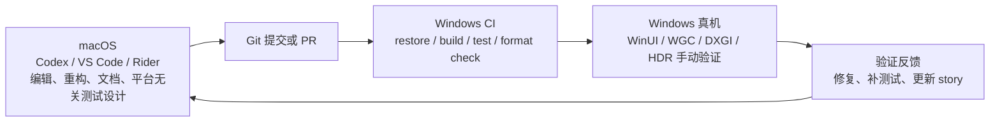

# Mac + Windows 开发工作流

Lumiere 是原生 Windows HDR 截图工具。项目可以在 macOS 上编辑和推进大部分代码设计，但构建、运行、WinUI 调试、WGC/DXGI/HDR 验证必须由 Windows 环境完成。

## 推荐工作流



## macOS 上可以做的事

- 阅读、编辑和重构 C# 源码。
- 设计接口、状态模型、生命周期协调和诊断模型。
- 编写不依赖真实 WinUI/DXGI/WGC 运行时的单元测试。
- 更新 PRD、architecture、story、project context 和开发文档。
- 检查模块边界、资源释放顺序、错误状态语义和测试覆盖计划。

## 必须在 Windows 上完成的事

- `dotnet restore Lumiere.sln`
- `dotnet build Lumiere.sln -p:Platform=x64`
- `dotnet test tests/Lumiere.Graphics.Tests/Lumiere.Graphics.Tests.csproj -p:Platform=x64`
- `dotnet format Lumiere.sln --verify-no-changes`
- WinUI 3 应用启动、窗口行为和 `SwapChainPanel` attach/detach 验证。
- `Windows.Graphics.Capture` target selection、frame pool、capture session 和权限验证。
- D3D11/DXGI swap chain、scRGB color space、HDR 显示器和多显示器场景验证。
- 任何需要 Visual Studio、Windows App SDK、Windows SDK、GPU 或 HDR 显示器参与的调试。

## 架构约束

为了让 macOS 编辑和 Windows 验证都稳定，代码必须继续保持窄平台边界：

- `Lumiere.App`：只负责 WinUI app startup 和 composition wiring。
- `Lumiere.Overlay`：只负责全屏 overlay、crop UI、键鼠状态和用户交互。
- `Lumiere.Capture`：只负责 WGC target、frame pool/session lifecycle 和 frame disposal。
- `Lumiere.Graphics`：只负责 D3D11/DXGI device、swap chain、HDR constants、presentation 和 rendering。
- `Lumiere.Infrastructure`：只封装 native interop、WinRT/COM bridge、Win32 window style、UI-thread helper。
- `Lumiere.Settings`：只保存本地偏好，不引入平台验证逻辑。

平台相关 API 不应散落到 UI 或测试代码中。新增 WGC、WinUI、DXGI、COM、Win32 调用时，要先放进对应边界，再通过小接口向其他模块暴露。

## 何时需要调整架构

当前架构适合 Mac-edit/Windows-validate，不需要为了 macOS 改成跨平台 UI 或改变 Windows target framework。

只有当下列问题反复出现时，才考虑进一步拆分平台无关核心：

- 大量状态机、裁剪几何、诊断映射或设置逻辑无法在 macOS 上运行自动化测试。
- Windows-only package reference 让本不该依赖平台的模块也难以被单独测试。
- Story 经常因为缺少 Windows 环境而无法验证纯业务规则。

届时优先新增平台无关项目，例如 `Lumiere.Core` 或 `Lumiere.Abstractions`，目标框架使用普通 `net10.0`，只放：

- immutable state snapshots
- typed result/status objects
- crop geometry and bounds logic
- diagnostics mapping
- settings schema and validation
- interfaces that do not expose WinUI/WGC/DXGI/COM types

不要把 `Lumiere.App`、`Lumiere.Overlay`、`Lumiere.Capture`、`Lumiere.Graphics` 或 `Lumiere.Infrastructure` 改成跨平台实现；它们仍然是 Windows-native 边界。

## Story 完成标准

在 macOS 上实现 story 时，完成记录必须明确区分三类验证：

- `Mac-pass`：已完成源码编辑、静态检查、文档更新或可离线推理的测试设计。
- `Windows CI-pass`：已在 Windows CI 或 Windows 开发机运行 restore/build/test/format。
- `Windows manual-pass`：已在 Windows 真机验证 WinUI/WGC/DXGI/HDR 行为。

如果某个 story 涉及 WinUI、WGC、DXGI、D3D11、HDR 显示器或多显示器行为，没有 `Windows manual-pass` 时不得宣称完整完成；只能标为需要 Windows 验证的实现或 review candidate。

## CI 角色

Windows CI 是 macOS 开发的最低验证门槛。CI 应该至少运行：

```powershell
dotnet restore Lumiere.sln --disable-parallel --verbosity minimal /nr:false
dotnet build Lumiere.sln -p:Platform=x64 --no-restore --verbosity minimal /nr:false
dotnet test tests/Lumiere.Graphics.Tests/Lumiere.Graphics.Tests.csproj -p:Platform=x64 --no-restore --verbosity minimal /nr:false
dotnet format Lumiere.sln --verify-no-changes --verbosity minimal
```

CI 只能证明代码在 Windows 工具链上能构建并通过自动化测试。它不能替代真实 HDR 显示器、WGC 权限、窗口线程、swap-chain presentation 或视觉正确性验证。

## 本地环境建议

macOS：

- 使用仓库作为主要编辑环境。
- 不要为了迁就 macOS 改掉 `net10.0-windows10.0.19041.0`、`win-x64`、WinUI 3 或 HDR/DXGI 技术路线。
- 若本机没有 .NET SDK，也可以继续做文档和代码编辑，但不能声称本地构建已通过。

Windows：

- 使用 Visual Studio 2022，安装 WinUI / Windows App SDK desktop development workload。
- 安装 .NET 10 SDK。
- 安装 Windows SDK `10.0.26100.x` 或项目记录的兼容版本。
- 优先使用真实 Windows x64 机器验证 HDR；Windows on Arm / 虚拟机可以做普通构建和 UI smoke test，但不能作为 HDR 正确性的唯一依据。
