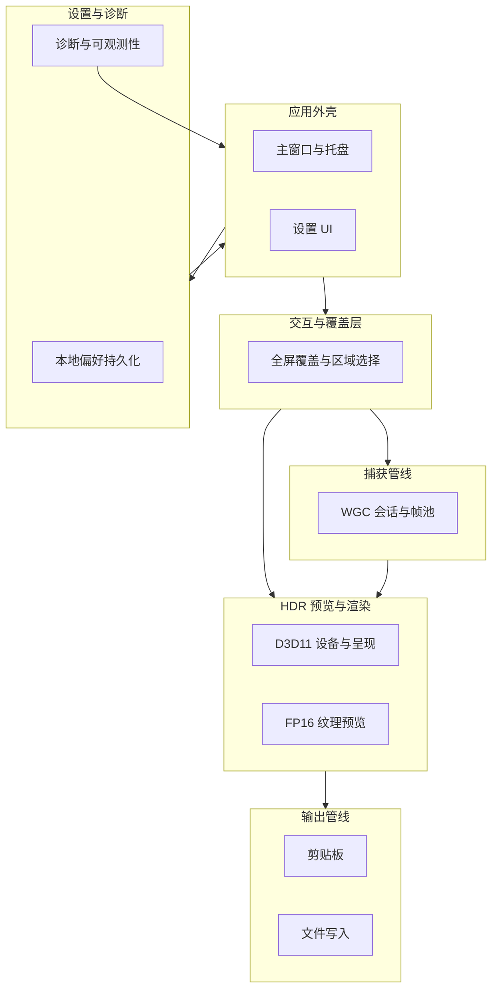

# Lumiere - HDR 原生 Windows 截图工具

> 项目规划文档 / AI 协作上下文 Harness  
> 最后更新：2026-05-09

---

## 项目目标（长期不变）

开发一款 **原生 Windows** 桌面截图工具。核心诉求是在 **HDR 显示器** 上截图时，结果尽可能与肉眼所见一致：避免被 DWM/管线错误色调映射成“发白、发灰、过曝”的观感。

技术路线围绕 **FP16 捕获 + 高保真预览/导出** 展开，不因短期实现便利而引入与 HDR 目标冲突的默认降级路径；任何“SDR 回退”或导出语义都必须在架构与验证层面单独论证，不得写进本规划作为既定产品承诺。

**当前权威 MVP 交互与界面范围** 以 [`harness/design/v0-mvp-reference/`](../design/v0-mvp-reference/) 及 [`harness/design/index.md`](../design/index.md) 中的说明为准。该原型为 **UX 参考**（Next/React），**不得**将 Web 技术栈或组件实现迁入生产代码；WinUI 3 与原生图形管线仍是行为与正确性的唯一来源。

---

## 产品判断（长期不变）

Lumiere 的理想体验是：用户通过快捷键、托盘或主窗口触发截图，直接完成全屏或区域捕获，并按设置复制/保存结果；整个过程低打扰、可重复，截图结果在 HDR 显示器上尽可能接近肉眼所见。

相比 Windows 自带截图、Snipping Tool 或普通 SDR 截图工具，Lumiere 的关键差异不是更多编辑功能，而是把 **HDR 保真** 作为产品存在理由：默认路径必须围绕 FP16/scRGB 捕获、预览与输出语义展开，避免把 HDR 内容过早压入不可信的 SDR 结果。

产品优先级按以下顺序取舍：

1. **保真度是根本差异**：若捕获结果发灰、发白、过曝或色彩语义不清，Lumiere 即失去存在理由。
2. **流程速度是 MVP 成败关键**：用户不应为了 HDR 正确性忍受繁琐选择器、重标注界面或多步导出流程。
3. **可信状态反馈是信任保护层**：HDR 能力、系统状态、导出语义与验证级别必须准确表达，不用未经验证的“已支持”话术替代真实状态。

---

## 当前 MVP 路线

MVP 聚焦 **低打扰、可重复的截图闭环**：从主窗口或托盘进入捕获 → 全屏或区域选择 → 完成一次输出（剪贴板与/或落盘）→ 轻量反馈后回到用户工作。

与设计稿一致的交互意图包括（详见 [`harness/design/index.md`](../design/index.md)）：

- 主窗口以截图入口为优先，控件标签保持可读、避免无意义换行堆砌。
- 捕获进入 **直连显示器/区域** 工作流，**不以“先弹系统选取器”** 作为默认打断。
- 区域选择在有效裁剪释放后完成捕获/复制，并给予轻量反馈。
- 引导页、图库、重标注型覆盖层、扩展导出工作流等 **默认列为 MVP 之后**，除非单独 story 拉回范围。

---

## MVP 功能范围（对齐 v0 设计稿）

以下能力以设计稿中的 **主面板、设置面板、托盘菜单、HDR 状态展示** 为视觉与信息架构参考，在 WinUI/Fluent 中落地：

详细功能拆分见 [`mvp-feature-list.md`](mvp-feature-list.md)；本节只保留高层范围，避免重复维护。

| 区域 | MVP 能力 |
| --- | --- |
| **主面板** | 全屏截图、区域截图；展示快捷键提示；展示 HDR 相关状态摘要；进入设置；可最小化（托盘延续使用）。 |
| **托盘** | 与主面板一致的捕获入口（全屏/区域）及快捷键展示；打开主窗口、打开设置、退出。 |
| **设置** | 全屏/区域 **快捷键** 配置；**输出目标**：剪贴板 / 文件夹 / 二者；**保存路径**（当需要落盘时）；**捕获后是否打开**、**文件名时间戳** 等输出偏好；剪贴板场景下的 **复制为图片** 等选项；**HDR 不可用时的提示** 开关；**导出/色彩格式** 相关选项（设计稿中为 HDR10 / P3 / sRGB 等——具体编码与是否提供多档须以 HDR 不变量与 Windows 验证为准，见下文）。 |
| **HDR 状态** | 设计稿模拟多种状态（如就绪、系统 HDR 未开、无 HDR 显示设备）；产品侧需用真实系统/显示能力映射，文案与分级遵循 [`harness/design/design-principles.md`](../design/design-principles.md) 中的验证语言。 |

---

## 技术栈与平台约束

| 层级 | 技术 |
| --- | --- |
| 运行时 | .NET 10（目标 TFM：`net10.0-windows10.0.19041.0`） |
| UI | WinUI 3（Windows App SDK） |
| 图形与 DXGI | Direct3D 11、DXGI；可选用 `Vortice.Windows` 等封装 |
| WinRT / COM | `Microsoft.Windows.CsWinRT` 等 |
| 屏幕捕获 | `Windows.Graphics.Capture` (WGC) |

- **目标平台**：Windows x64；HDR 与多显示器行为以 **Windows 真机** 验证为准（可与 [`harness/workflows/cross-platform-development.md`](../workflows/cross-platform-development.md) 中的 Mac 编辑 / Windows 验证流程配合）。
- **日志**：使用结构化日志（如 `ILogger`），避免 `Console.WriteLine` 作为产品诊断手段。

---

## 分层架构设计（职责导向）

规划以 **职责分层** 描述系统，**不将当前仓库中的程序集/文件夹命名** 固定为最终架构；实现可随演进调整拆分，只要依赖方向与边界清晰。

建议分层与依赖方向（上层可依赖下层抽象，避免底层依赖 UI 细节）：

- **应用外壳**：窗口生命周期、托盘、导航至设置、全局快捷键注册与冲突处理（与系统约定一致）。
- **交互与覆盖层**：全屏遮罩、指针拖拽、区域几何、取消/确认、与捕获/预览生命周期的协调。
- **捕获管线**：WGC 目标选择策略（符合 MVP“非选取器优先”）、帧池格式、会话与资源的创建/释放顺序。
- **HDR 预览与渲染**：设备与交换链、色彩空间与 FP16 呈现路径；预览“所见”与导出语义的一致性需在设计与测试中显式追踪。
- **输出管线**：剪贴板与文件路径、命名与时间戳；与 HDR/色彩格式的实际编码能力对齐，不向用户承诺未实现格式。
- **设置与诊断**：持久化 schema、迁移策略；日志与错误呈现不泄露敏感路径以外的安全风险。

**平台 API 集中原则**：Win32 互操作、WGC、DXGI、D3D、WinRT 桥接等应落在明确的实现边界内，通过 **窄接口** 暴露给外壳与交互层，避免在 XAML code-behind 中散落原生调用。

---

## HDR 与截图正确性不变量

下列约束适用于 **预览与捕获链路** 的默认路径；若 story 要求偏离，须单独记录风险与验证计划。

1. **捕获像素格式**：WGC `Direct3D11CaptureFramePool` 使用 **FP16**（`DirectXPixelFormat.R16G16B16A16Float`），以保证 HDR 内容不在捕获阶段被压成 8-bit。
2. **预览交换链**：用于 HDR 预览的 swap chain 使用 **FP16** 格式（如 `DXGI_FORMAT_R16G16B16A16_FLOAT`）与 **scRGB** 色彩空间（如 `DXGI_COLOR_SPACE_RGB_FULL_G10_NONE_P709`），并与 WinUI `SwapChainPanel` 的原生互操作方式一致。
3. **资源生命周期**：纹理、帧池、捕获会话、交换链等 **必须** 可预期释放；重入捕获、取消、窗口关闭路径不得泄漏 COM/D3D 对象。
4. **线程模型**：`FrameArrived` 等回调与 UI 更新之间必须通过 **DispatcherQueue**（或等价机制）协调，避免后台线程直接触碰 UI 或 panel 呈现。
5. **透明覆盖窗口**：全屏覆盖如需分层、点击穿透或区域命中，通过 Win32 / AppWindow 能力与产品交互模型一致实现，并记录与 DWM/HDR 全屏场景的已知限制。

**设计稿中的导出格式（HDR10 / P3 / sRGB）** 是 **UX 占位与讨论起点**：落地时必须映射到真实编码器、色彩元数据与验证级别；在未完成 Windows 手动验证前，规划文档与 UI 均不得将其表述为已完成特性。

---

## UX 实现准则

- **原生优先**：控件、密度、键盘与辅助功能遵循 WinUI/Fluent 与 Windows 11 惯例；参考 [`harness/design/design-principles.md`](../design/design-principles.md)。
- **原型边界**：从 v0 参考继承 **布局意图、文案层级、信息架构**，不继承 Web 组件实现。
- **验证语言**：任何“完成”“HDR 正确”的表述应区分 Mac 文档、Windows CI、Windows 真机验证（见设计原则中的 Validation Language）。

---

## 执行路线（MVP 顺序）

1. **最小捕获闭环**：在目标显示器上建立 WGC FP16 捕获 → 纹理进入预览管线 → 可取消/重入且资源干净。
2. **区域选择与提交**：覆盖层几何与提交语义对齐设计稿（释放有效区域即完成）；全屏路径无额外打断。
3. **输出**：按设置组合剪贴板与/或落盘；文件名与时间戳策略；可选“捕获后打开”。
4. **应用外壳**：主面板与设置导航；托盘菜单与全局快捷键；与设计稿一致的捕获入口并列关系。
5. **HDR 状态与提示**：映射真实系统状态；`HDR 不可用/未开启` 时的提示受设置开关约束。
6. **设置持久化与打磨**：schema 稳定、默认值安全；与设计稿对齐的导出/色彩选项在 **验证通过后** 逐步解锁或灰度。

---

## 验证标准

- **Windows CI**：`dotnet restore` / `build` / `test` / `format`（见 [`AGENTS.md`](../../AGENTS.md) 与 cross-platform 工作流）。
- **Windows 真机**：WinUI 启动、WGC 权限、交换链呈现、HDR 显示器上的视觉抽查、多显示器与常见分辨率场景。
- **完成定义**：涉及 WGC、DXGI、HDR 显示行为的 story，若无真机验证记录，不得标为完整交付，仅可作为实现中或待验证。

---

## 当前状态

- [x] Harness 与 MVP 设计参考（v0）已纳入 [`harness/design/`](../design/)
- [x] 解决方案与分层实现工程已存在（具体程序集命名可随架构演进调整）
- [ ] 主窗口 / 托盘 / 设置与 v0 信息架构对齐（WinUI 落地）
- [ ] MVP 捕获闭环在 Windows 真机 HDR 场景下通过验证
- [ ] 输出管线（剪贴板 + 落盘）与设置项端到端一致
- [ ] HDR 状态与提示与真实系统能力映射，文案符合验证语言

---

## AI 协作避坑（实现时必读）

1. **COM / 非托管资源**：GC 不管理 D3D/COM；必须在会话结束、重新捕获、窗口关闭等路径上 **确定性** 释放。
2. **线程**：捕获回调线程 ≠ UI 线程；更新 `SwapChainPanel` 或 WinUI 状态前须调度到 UI 线程。
3. **覆盖层窗口**：透明、分层、鼠标命中与“可点击区域”需与产品交互一致，并注意全屏 HDR 下的边界情况。
4. **勿将原型当规格**：色彩格式、HDR 文案、fallback 等以代码不变量 + Windows 验证为准，而非 React 原型默认值。
